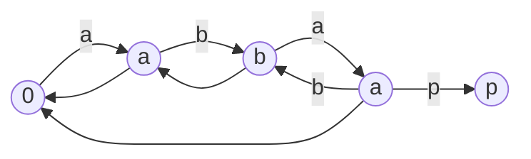
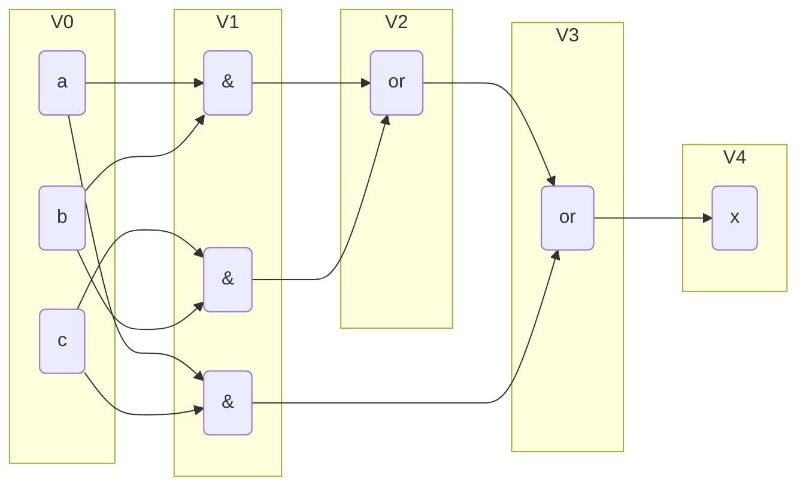
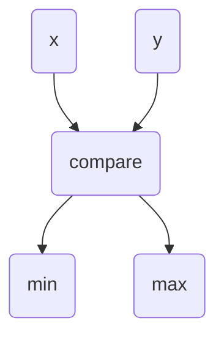
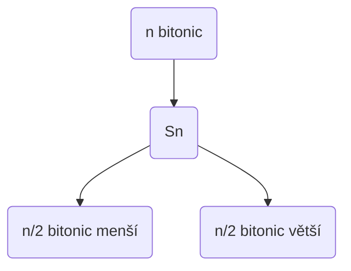
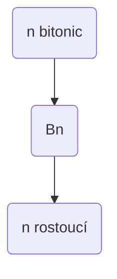
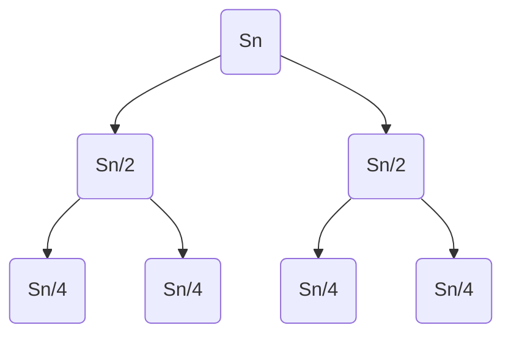
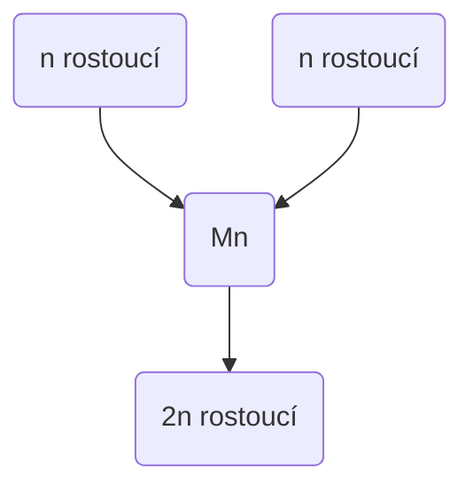
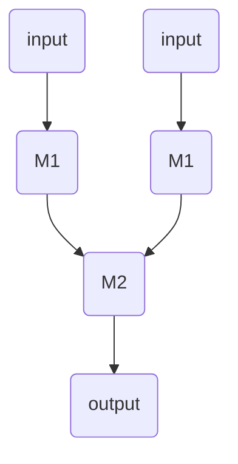
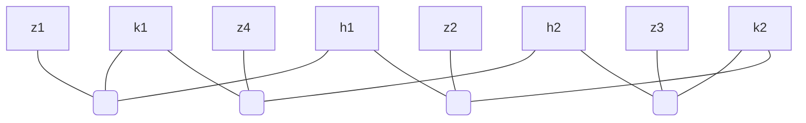
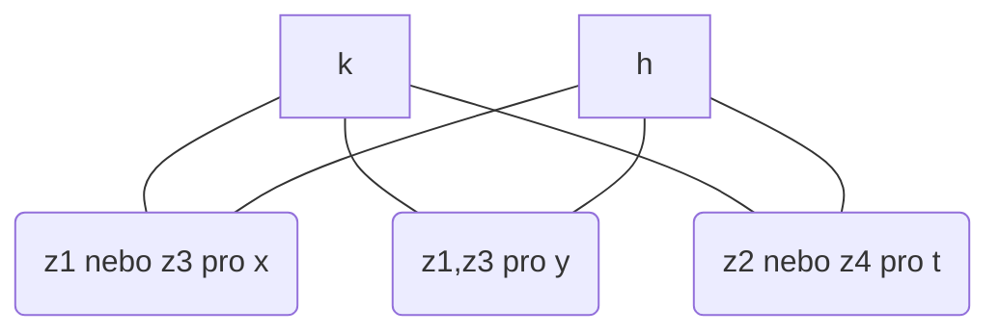

*Přednáška 1*

## **Vyhledávání v textu**
- jak hledat nejdelší souvislý podřetězec

### **Značení**
- $\Sigma$
	- abeceda (ABC...Z, {0,1}, UNICODE, české slova)
	- musí byt konečná a konstantní (předpokládáme že je menší, takže lze indexovat jako pole)
- $\Sigma^*$
	- množina všech řetězců
- $\alpha, \beta, \gamma, \dots$
	- označení pro řetězec
- $x, y, z, \dots$
	- označení pro jeden znak
	- budeme počítat s tím, že znak je stejný jako řetězec o délce 1
- $|\alpha|$
	- délka řetězce (počet znaků)
- $\epsilon$
	- prázdný řetězec ($|\epsilon|=0$)
- $\alpha\beta$
	- slepení řetězců (konkantenace, zřetězení)
- $\alpha[i]$
	- i-ty znak v $\alpha$ řetězci
- $\alpha[i:j]$
	- podřetězec, který je od i až po j-1 včetne
	- Pozorování: každý podřetezec je prefixem suffixu
	- $\alpha[:j]$ - prefix
	- $\alpha[i:]$ - suffix

## Problém
- máme vstup
	- seno ($\sigma$), kde $S := |\sigma|$
	- jehla ($\iota$), kde $J := |\iota|$
- a chceme výstup
	- $\{ i | \sigma [i : i + J] = \iota\}$

### Triviálni postup
- postupne zkoušet všechny znaky a pokud se shodne zkoušet další za ním (brute force)
- to bude trvat $\Theta(SJ)$
- *teoreticky by pokaždé když nenajdu, tak zahodím a pokračuji kde jsem zkončil, to ovšem nelze, protože se nenajde vše* 

### Inkrementalní alg
- Stav $\alpha:=$ jaký nejdelší prefixu $\iota$, který je suffixem $\sigma$.
	- s tím že berem menší seno a postupně přidáváme poslední znaky
- Nový stav:
	1. $\epsilon$ to pokud x (nový znak) nefiguruje v jehle
	2. $\alpha'x$ suffix $\sigma x$ a ktomu je i prefix jehly (bez i s x) a smaozřejmě $\alpha$ je suffixem $\alpha$
- Předvýpočet:
	- Zpětná fce - pro stav $\alpha$: $Z(\alpha):=$ nejdelší vlastní *($\alpha' \neq \alpha$)* $\alpha'$ suffix $\alpha$, který je prefixem $\iota$

### **KMP (Knuth, Morris, Pratt)**
- využívá **Vyhledávacího automatu**
	- má dané stavy ($0, 1, \dots, |\iota|$)
	- postupuje v grafu stavů
	- reprezentuje se řetězcem $\iota$ a polem $Z[0, \dots, J]$
	- pro nakreslení grafu se používá jednoduchá cesta na ktere jsou vrcholy prefixy slova a hrany jsou dané písmena pro zvýšení prefixu, dále jsou zde zpětné hrany a ty jdou z každeho vrcholu a vede do vrcholu který má stejný suffix



##### Krok automatu
```text
j := jehla
Krok(i, x): \\i - stav, x - nové písmenko
	dokud j[i] != x:
		je-li i == 0: vrátit 0
		i <- Z[i]
	vrátit i+1
```

##### Algoritmus hledání
```text
s := seno
Hledej(s):
1. i <- 0
2. pro j = 0 ... |s|-1:
3.     i <- Krok(i, s[j])
4.     pokud i = J:
           ohlásit výskyt na j-J+1
```
- Tento postup ale spadne na konci protože nemám hranu z posledního stavu. To se dá vyřešit testem anebo prázdným vrcholem.

- **Lemma:** Hledej ($\sigma$) trvá v čase $\Theta(S)$.
	- dk.: #zpětných hran $\leq$ #dopředných hran $\leq$ S
		- dopředu se posouvám o jednu hranu pokaždé a dozadu minimálně o jednu, takže se nemůže stát abych se cyklil dozadu
- Pozorování: Pokud $\alpha$ je stav a pustíme automat na vstup $\alpha[1:]$, pak zkončíme na stavu $Z(\alpha)$ (neboli zpětná funkce).

##### Konstrukce automatu: (toto trvá $\Theta(J)$)
```text
j := jehla
1. Z[0] <- 0, Z[1] <- 0
2. i <- 0
3. pro k = 2, .., J:
4.     i <- Krok(i,j[k-1])
5.    Z[k] <- i
```
> Bootstrapping - sám sebe konstrujuje.

- **Věta:** KMP najde všechny výskyty v čase $\Theta(S+J)$.

#### Obecněji
- jehly $\iota_1, \iota_2, \dots, \iota_n$ o délkách $J_1, J_2, \dots, J_n$
- seno $\sigma$ o délce S
- chceme: $\{ (i,j) | \iota_i = \sigma[ i : j + |\iota_i|] \}$
- čas $\Theta(S + \sum_i J_I + V)$, kde V je počet výskytu
- idea:
	- budeme místo grafu používat trie
	- musíme ale najít i ostatní slova a tak budeme využívat zkratky

* * *

*Přednáška 2*

## **Aho - Corasickova algoritmus**
- $\iota_1 \dots \iota_n$ - jehly
- $\sigma$ seno
- stavy jsou prefixy všech jehel
- hrany:
	1. dopředná
		- posunutí o jeden znak v prefixu
	2. zpětná
		- $\alpha \to$ nejdelší vlastní suffix řetězce $\alpha$, který je stavem
	3. zkratka
		- $\alpha \to$ nejbližší koncový stav po zpětných hranách

#### Reprezentace automatu
- vybudovaná trie
- stavy očíslujeme, 0 = kořen ($\epsilon$)
- Properties (mohou byt i prázndé):
	- `Slovo(i)` $:=$ která jehla končí ve stavu `i` 
	- `Zpět(i)` $:=$ kam vede zpětná hrana ze stavu `i` 
	- `Zkratka(i)` $:=$ kam vede zkratka ze stavu `i` 
	- `Dopředu(i, x)` $:=$ kam vede dopředná hrana ze stavu `i` pro písmeno `x`

##### Krok automatu
```text
Krok(s,x): // s - stav, x - znak
Dokud Dopředu(s,x) = null
	Pokud s = kořen, vrátíme s
	s <- Zpět(s)
Vrátíme Dopředu(s,x)
```

##### Hledání jehel
```text
s := seno
j := jehla
Hledej(s)
s <- kořen
Pro i = j ... S-1:
	s <- Krok(s, s[i])
	t <- s
	Dokud t != null
		Je-li Slovo(t) != null
			vyhlásit výskyt
		t <- Zkratka(t)
```

- **Lemma:** Hledej běží v čase $O(S +\# \text{ výskytů })$.
	- Dk: S je jako u KMP, a vždy jednou zkontrolujeme výskyt (to se schová do S) a potom opakujeme pokud je vícero výskytů.

#### Konstrukce automatu
- bude se postupovat po vrstvách (jako BFS)
```text
j := jehla
Konstrukce(j...j):
1. Vybudujeme trii pro j...j
			-> dopředné hrany
			-> r = kořen
2. Zpět(r) = null, Zkratka(r) = null
3. Zpět(s) = r, Zkratka(s) = null pro s syny r
4. F <- fronta se syny kořene
5. Dokud F != empty
6.     v <- Dequeue(F)
7.     Pro s syny v:
8.         z <- Zpět(v)
9.         Zpět(s) <- Krok(z, písmeno na hraně vs)
10.        s <- Enqueue(F)
11.        Pokud Slovo(z) != 0
12.            Zkratka(s) <- z
13.        Jinak 
14.            Zkratka(s) <- Zkratka(z)
```

- **Lemma:** Konstrukce běží v čase $O(\sum_iJ_i)$
	- Dk: Trie se buduje v tomto čase a BFS trvá lineárně na počtu hran a vrcholů, což je teď prakticky stejné číslo.
- **Věta:** Nalezení všech jehel v seně trvá $O(S+\# \text{ výskytů } +\sum_iJ_i)$.

### Robinův-Karpův algoritmus
- řešení problému pomocí hešovací funkce
- jednoduše na začátku zpočítat hash jehly a pak postupně počítat hashe pro všechny podřetězce
	- protože se budou dát lehce přepočítat, tak to nebude trvat tak dlouho, ale lineárně se projde přes seno
	- $h(x_0, x_1, \dots x_{J-1}) := (x_0p^{J-1} + x_1p^{J-2} + \dots + x_{J-1}p^0) \ mod \ H$
	- pro přepočítání $h(x_1, x_2, \dots x_{J}) = (h(x_0, x_1, \dots x_{J-1}) - x_0p^{J-1}) \cdot p + x_Jp^0$
	- lze videt, že se to dá stihnout v konstantním čase

##### Algoritmus:
```text
s := seno
j := jehla
0. Zvolíme p ze Z_h náhodně
1. c <- h(j), a <- h(s[:J]), p^J
2. Pro 0, ..., S-J:
3.     Pokud a = c && s[i:i+J] = j, tak nahlásit výskyt
4.     a <- (ap - s[i] + s[i+1]) mod H
```

#### Složitost
1. režie + počítaní hashů $O(S)$
2. skutečné výskyty $O(J \cdot V)$, kde V je počet výskytů
3. falešné výskyty
	- pro ideální hešovací fci $\text{Pr[falešný výskyt]} = \frac{1}{H}$, průměrný čas $O(\frac{\text{SJ}}{\text{H}})$
- Pak celkově je to součet, ale hashovací funkce není ideální.

#### Něco k polynomům.
- $P(x) := p_0x^0 + p_1x^1 + \dots + p_{n-1}x^{n-1}$
- **Lemma:** Pokud $x_1, \dots, x_k$ jsou všechny kořeny polynoů P, pak: $P(x) = (x -x_1)(x-x_2)\dots(x-x_k)Q(x)$, kde $Q$ je polynom bez kořenu.
	- Důsledek: Polynom stupně $d$ ma nejvýš $d$ kořenů.
- **Lemma:** Nechť $P,Q$ jsou polynomy stupně $< n$ , $x_1\dots x_n$ navzájem různá čísla, tak že $\forall i : P(x_i) = Q(x_i)$ . Potom $P \equiv Q$.
	- Dk: Když se vezme $R:=P-Q$ , tak $\forall i R(x_i) = 0$ , potom $R \equiv 0 \implies P \equiv Q$ .
- Jak je to doopravdy s hashem.
	- $P(r) = h(\iota)$
	- $Q(r) = h(\sigma [i:i+J])$
	- Pravděpodobnost že $P(r) = Q(r)$ je $\frac{J}{H}$.

* * *

*Přednáška 3*

## **Toky v sítích**
- máme orientovaný (symetrický) graf
- **Df:** Síť se skládá z:
	- $G(V,E)$ orientovaný graf
	- $z,s \in V$ zdroj a spotřebič (stok)
	- $c: E \to \mathbb{R}_0^+$ kapacity hran
- **Df:** Tok je $f: E \to \mathbb{R}_0^+$, tak že
	1. $\forall e \in E: f(e) \leq c(e)$
	2. $\forall v \in V v\neq s,z: f^\Delta(v)=0$ - Kirchhoffův zákon
- $f^+(v) = \sum_{uv \in E}f(uv)$ - přítok
- $f^-(v) = \sum_{vw \in E}f(vw)$ - odtok
- $f^{\Delta}(v) = f^+(v) - f^-(v)$ - přebytek
- **Df:** $|f| = f^\Delta(s)$ - velikost toku
	- Pozorování: $f^\Delta(s) = - f^\Delta(z)$
		- Díky tomu že $0 = \sum_{v}f^{\Delta}(v) = f^{\Delta}(s)+f^{\Delta}(z)$. Každá hrana přispěje jednou kladně a jednou záporně.

- Existuje max tok? To si dokážeme pomocí algoritmu, který ho najde.

### Fordův-Fulkeronův algoritmus
- Vychází z primitivního principu nalezení nějaké cesty, která zlepší velikost toku.
- **Df: Rezerva** hrany $uv$ je $r(uv)=c(uv)-f(uv)+f(vu)$.
	- Je to vlastně součet toho co jde po směru (první dva prvky) a co jde proti směru.

##### Algoritmus:
```text
1. f <- 0
2. Dokud existuje P nenasycená cesta z->s:
3.   epsilon <- min r(e), e in P
4.   pro vsechny uv in P:
5.     delta <- min(epsilon, f(uv))
6.     f(v,u) <- f(v,u) - delta
7.     f(u,v) <- f(u,v) + epsilon - delta
```

#### Konečnost:
1. Pro celočíselné kapacity: ANO
2. Pro racionální kapacity: ANO
3. Obecně ale NE

### Věta (Edmons a Karp):
- Pro nejkratší nenasycenou cestu je počet iterací $O(nm)$.
	- Potom F-F běží v $(O(nm^{2})$.

- **Df:** Pro $A,B \subseteq V$ je $E(A,B):=\{a,b \in E| a \in A, b\in B\}=E \cap (A \times B)$.
- **Df:** Elementární řez $:=E(A,B)$ pro jakékoliv $A,B \subseteq V$, $A \cup B = V$, $A \cap B = \emptyset$, $z \in A, s \in B$.
	- $f(A,B) := \sum_{e\in E(A,B)}f(e)$ je kapacita řezu
	- $f^{\Delta}(A,B) = f(A,B) - f (B,A)$
	- Pozorování $f^{\Delta}(A,B) = |f|$, protože $f^{\Delta}(A,B) = \sum_{v \in B}f^{\Delta}(v) = f^{\Delta}(s) = |f|$.

### Lemma:
- $\forall f$ tok, $\forall E(A,B)$ řez $|f| \leq c(A,B)$.
	- Protože $f^{\Delta}(A,B) = f(A,B) - f(B,A)$, kde $f(A,B) \leq c(A,B)$ a $-f(B,A) \leq 0$.

### Situace po zastavení F-F
- graf se mi rozdělí na dvě části a z té první do druhé vedou hrany které jsou nasycené a zpětné hrany mají nulu
- přesněji to je pak $A:= \{ v| \exists \text{ cesta ze } z \text{ do } v \text{ po hranách s } r>0 \}$ a $B:= V \setminus A$
- Kdyby z $A$ do $B$ vedly hrany s $f < c$ tak, by se dala cesta prodloužit do $B$.
- Tohle se také dá použít pro sestrojení minimálního řezu.

**Df: Párování** v grafu $G=(V,E)$ je $F \subseteq E$ takové, že $\forall e,f \in F: e \cap f = \emptyset$.

### Největší párování v bipartitních grafech
- Přidáme vrcholy $z,s$ a pak napojíme $z$ na vrcholy levé partity a nasměrujem daným směrem, pak všechny hrany z levé partity zorientujeme do pravé partity a z té povedou hrany do $s$. A $\forall e : c(e) = 1$.
- Pak budeme hledat největší celočíselný tok $f$. Následně pak párování budou hrany původního grafu s $f=1$.
- MAX tok $\Leftrightarrow$ největší párování.

### Věta:
- $\forall e \in E: c(e) \in \{0,1\}$ pak F-F algoritmus doběhne v čase $O(nm)$.

#### *Důkaz:*
- Protože každou iterací zvětšíme tok o jedna max o 2. A celkově je MAX tok omezený na $n$ kvůli řezu ze zdroje.

**Df: Čistý** tok $f^{\ast}$ k toku $f$: $f^{\ast}(u,v) := f(uv) - f(vu)$.

- Pozorování:
	1. $f^{\ast}(uv) = -f^{\ast}(vu)$
	2. $f^{\ast}(uv) \leq c(uv)$
	3. $\forall v \in V, v\neq z,s: f^{\Delta}(v) = 0$ pro $f^{\Delta}(v) := \sum_{uv \in E}f^{\ast}(uv)$.

### Lemma:
- Každá funkce $g:= E \to \mathbb{R}$ splňující 1. 2. 3. $\exists f$ tok $g = f^{\ast}$.

#### *Důkaz:*
- BÚNO $g(uv) \geq 0$ pak $f(uv) = g(uv)$ a $f(vu) = 0$.

Pozorování: $r(uv) = c(uv) - f^{\ast}(uv)$

* * *

*Přednáška 4*

- $-c(vu) \leq f^{\ast}(uv) \leq c(uv)$
- $r(uv) = c(uv) - f(uv) + f(vu)$ takže $r(uv) = c(uv) - f^{\ast}(uv)$

**DF:** K síti $S=(V,E,z,s,c)$ a toku $f$ definujeme sít rezerv $R(S,f) = (V,E,z,s,r)$.

### Lemma Z (o zlepšování):
- Necht $f$ je tok v síti $S$ a $g$ je tok v $R(S,f)$ pak existuje $f'$ tok v $S$ takový, že $|f'|=|f|+|g|$ (lze sestrojit v $O(m)$).

#### *Důkaz:*
- $f'^{\ast}:= f^{\ast} + g^{\ast}$ kde $g^{\ast} \leq c - f^{\ast}$ tudíž celkově $f^{\ast} + g^{\ast} \leq c$.

**Df:** Tok $g$ je blokující $\equiv \forall P$ cesta ze $z$ do $s \exists e \in P: g(e) = c(e)$.

**Df:** Síť je pročištěná (vrstvenná) $\equiv$ všechny vrcholy a hrany leží na nejkratších cestách ze $z$ do $s$.

## Dinicův algoritmus
```text
1. f <- 0
2. Opakujeme:
3.   R <- síť rezerv R(S,f), smažeme hrany s r=0
4.   l <- délka nejkratší zs cesty v R, pokud nekonečno konec
5.   Pročistíme R
6.   g <- blokující tok v R
7.   Zlepšíme f pomocí g
```
- tato fáze trvá $O(nm)$

### Lemma K (korektnost):
- Když se algoritmus zastaví $f$ je maximální tok.

#### *Důkaz:*
- $\nexists$ nenasycená cesta ze $z$ od $s$.

### Čištění sítě
```text
1. BFS ze z -> rozdělení do vrstev
2. Smažeme vrstvy z a s
3. Smažeme hrany zpět/uvnitř vrstvy
4. F: fronta <- {v|out-deg(v) = 0, v not s}
5. Dokud F není prázdná:
6.   Vybereme v z F
7.   Smžeme v a hrany do něj
8.   Klesneli nějaký out-deg(v) na 0, tak ji přidáme do F
```

### Blokující tok
```text
1. g <- 0
2. Dokud existuje P cesta ze z do s:
3.   esilon <- min c(e) - g(e), e in P
4.   pro vsechny e in P: g(e) <- g(e) + epsilon
5.   kdykoliv je g(e) = c(e) smažeme e
6.   dočistíme sít (čištění 4-8)
```
- celkem tohlej e $O(n)$

### Lemma S (složitost):
- 1 fáze trvá $O(nm)$

### Lemma C (o délce cest):
- Mezi fázemi vzroste $l$ aspon o 1.
- Důsledek je že počet fází je $\leq n$.

#### *Důkaz:*
- Hrany se nejenmo mažou ale i přidají se jakožto s opačnou rezervou. Nové cesty mají aspoň l+2 hran.

### Věta:
- Dinicův algoritmus najde maximální tok v čase $O(n^{2}m)$.

#### **Df: Vlna** v síti je $f: E \to \mathbb{R}^{+}_{0}$ taková, že:
1. $\forall e f(e) \leq c(e)$
2. $\forall v \neq z,s: f^{\Delta}(v) \geq 0$

#### **Df:** Převedení přebytku z $v$ do $w$, přičemž $f^{\Delta}(v) \geq 0$, $r(vw) \geq 0$: 
- $\epsilon \leftarrow \min(f^{\Delta}(v), r(vw))$
- $f^{\ast}(vw) \leftarrow f^{\ast}(vw) + \epsilon$

- Pozorování: $r(uv)$ klene $f^{\Delta}(v)$ klesne a $f^{\Delta}(w)$ vzroste a to vše o $\epsilon$

**Df: Výška** je $h: V \to \mathbb{N}$.

* * *

*Přednáška 5*

#### Převedení z $u$ do $v$, kde:
1. $f^{\Delta}(v) > 0$
2. $r(uv) > 0$
3. $h(u) > h(v)$

## Goldbergův algoritmus
```text
1. všechny vrcholy v: h(v) <- 0 h(z) <- n
2. všechny hrany e: f(e) <- 0
   všechny vrcholy zv: f(zv) <- c(zv)
3. Dokud existuje u (není z ani s) delta-f(u) > 0:
4.   pokud existuje uv hrana: r(uv) > 0, h(u) > h(v)
5.     převedeme po uv
6.   jinak:
7.     h(u) <- h(u) + 1
```

### Invariant A (základní)
1. $f$ je vlna
2. $\forall v h(v)$ neklesá
3. $h(z) = n, h(s) = 0$
4. $\forall v \neq z: f^{\Delta}(v) \geq 0$

- Spád hrany $uv := h(u) - h(v)$.

### Invariant S (o spádu)
- Pokud $r(uv) > 0$, pak $h(u) - h(v) \leq 1$.

### Lemma K (o korektnosti)
- když se algoritmus zastaví $f$ je maximální tok.

#### *Důkaz:*
1. $f$ je tok - zastaví až je splněn Kirchhofův zákon
2. není-li $f$ max, $\exists$ nenasycená cesta ze $z$ do $s$
	- cesta překonává spád $n$, má max $n-1$ hran, tudíž existuje hrana o spádu $>1$ což je ve sporu s Inv. S

### Invariatn C (cesta)
- Pokud $f^{\Delta}(u) > 0$ pro $u \neq z,s$ pak $\exists$ nenasycená cesta z $u$ do $z$.

#### *Důkaz:*
- Všechny vrcholy z $u$ do kterých vede nenasycená cesta. Pak přes sečtení lze vidět, že součet bude záporný. Potom to ale znamená, že protože přebytek $u$ je kladný tak musí být aspoň jeden záporný a to je $z$.

### Invariant V (výška)
- $\forall v: h(v) \leq 2n$

### Lemma Z (o zvedání)
- Počet zvednutí $\leq 2n^{2}$.

**Df:** Převedení na hraně $uv$ je:
$$
\left\{
\begin{array}{ll}
\text{nasycené } \equiv r(uv) \text{ klesne na }0 \\
\text{nenasycené } \equiv \text{ jinak} \rightarrow f^{\Delta}(v) \text{ klesne na }0
\end{array}
\right.
$$

### lemma S (syté)
- Počet nasycených převedení je $\leq nm$.

#### *Důkaz:*
- Uvažme hranu $uv$
- mezi dvěma nasycenými převedeními hrany $uv$ se $u$ zvedne aspoň dvakrát
- kvůli Inv. V nastane tudíž maximálně $n$-krát

### lemma N (nenasycené převedení)
- Počet nenasycených převedení je $O(n^{2}m)$.

#### *Důkaz:*
- Pomocí potenciálu $\Phi := \sum_{v \neq z,s: f^{\Delta}(v) > 0}h(v)$
- Potom:
	1. $\Phi \geq 0$
	2. $\Phi_{\text{start}} = 0$
	3. zvednutí: $\Delta \Phi = +1$
		- za všechna pak $\Delta \Phi \leq 2n^{2}$
	4. syté př.: $\Delta \Phi \leq 2n$
		- za všechna pak $\Delta \Phi \leq 2n^{2}m$
	5. nenasycené př. $\Phi \leq -1$
		- protože 1. tak nanejvýš $2n^{2}+2n^{2}m$ krát $\in O(n^{2}m)$

### Implementace
- $S :=$ seznam $v \neq z,s: f^{\Delta}(v)>0$
- $\forall v: H(v):=$ seznam $vw \in E: r(vw) = 0 \text{ \& } h(v) - h(w) \geq 1$

#### Čas:
- výběr vrcholu a harny: $O(1)$
- převedení $O(1)$ -> $O(nm+n^{2}m)$
- zvednutí $O(n)$ ->  $O(n^{2})$
- celkem $O(n^{2}m)$

* * *

*Přednáška 6*

### Lemma N'
- V Goldbergově algoritmus s výběrem nejvyššího vrcholu je počet nenasycených převedení $O(n^{3})$.

#### *Důkaz:*
- $H:= \max\{ h(v) | f^{\Delta}(v)>0, v \neq z,s \}$
- Fáze končí změnou $H \Rightarrow$ buď zvýšení o 1 $O(n^{2}$) nebo snížení $O(n^{2})$.
- takže celkově je počet fází ($O(n^{2}$)
- Počet NP během 1 fáze $\leq n$

### Lemma N''
- Počet NP je $O(n^{2} \sqrt{m})$.

## Algebraické algoritmy
### Polynomy
$$
P(x) := \sum_{j=0}^{n-1}p_{j}x_{j}
$$

- $n$ je velikost polynomu
- normalizace: $p_{n-1} \neq 0$
- $\deg(P)$ stupeň $\max j: p_{j} \neq 0$ (nulový polynom: $\deg(P) = -1$)

### Násobení polynomů
- $P(x) \cdot Q(x) = R(x)$
$$
\left( \sum_{j=0}^{n-1} p_{j}x^{j} \right) \left( \sum_{k=0}^{m-1} p_{k}x^{k} \right) = \sum_{j,k} p_{j}q_{k}x^{j}x^{k} = \sum_{t=0}^{m+n-2} \left( \sum_{j=0}^{t} p_{j}q_{t-j} \right) x^{t}
$$

- tohle vede na časovou složitost $O(n^{2})$
- $\deg(PQ)$ = $\deg(P)$ + $\deg(Q)$
- konvuluce je když se postaví polynomy oproti sobě se začátky a postupně se posouvají a násobí, nebo-li jak je napsaná poslední suma
- Rovnost polynomů
	1. $\equiv$ identická - stejné koeficienty po normalizaci
	2. reálná funkce - $\forall x: P(x) = Q(X)$
	- ekvivalentní definice

### Lemma
- Nechť $P$ a $Q$ jsou polynomy stupně max $d$ a $\alpha_{0} \dots \alpha_{d}$ jsou navzájem různá čísla. Potom $\left( \forall j: P(\alpha_{j}) = Q(\alpha_{j}) \right) \Rightarrow (P \equiv Q)$.

### Lemma
- Nechť $P$ je polynom stupně $d \geq 0$. Potom $\exists$ nejvýše $d$ čísel (kořeny) $\alpha$ takové, že $P(\alpha)=0$.

#### *Důkazy:*
- $P(X) = (x - \alpha) Q(x)$
- $R \equiv P - Q$
- $R(x_{j}) = P(x_{j}) - Q(x_{j}) = 0 \Rightarrow R \equiv 0, P \equiv Q$

- $P$ polynom velikostu $n \Rightarrow$ deg $< n$
- Když $p_{0} \dots p_{n-1}$ jsou koeficienty tak si pevně zvolím $x_{0} \dots x_{n-1}$ navzájem různých. Potom $(P(x_{0}) \dots P(x_{n-1}))$ je graf.

### Plán algoritmu
```text
1. Doplníme k P,Q nulové koeficienty tak, abyl horních n/2 koef. byly 0
2. Zvolíme x(0) ... x(n-1)
3. (P(x(0)) ... P(x(n-1)))
   (Q(x(0)) ... Q(x(n-1)))
4. (R(x(0)) ... R(x(n-1))): R(x(j) = P(x(j)) Q(x(j))
5. Najdeme koeficienty R
```

- 1. a 4. umíme triviálně v $O(n)$ akorát 3. a 5. ne

### Idea Rozděl a panuj
- Polynom si rozdělíme na dvě části a ty budou vždy sobě opačné ($x_{j} = - x_{n/2+j}$).
- Pak si polynom $P$ rozdělím na dva poloviční polynomy $L,S$ jakožto lichý a sudý.
- $L$ bude mít liché stupně a $S$ sudé. Potom $P(X_{j}) = S(x_{j}^{2}) +x_{j}L(x_{j}^{2})$ a $P(-X_{j}) = S(x_{j}^{2}) - x_{j}L(x_{j}^{2})$.
- Klasické rozdělení na dvě části poloviční velikosti. Takže $T(n) = 2T(n/2) + \Theta(n)$ což je $T(n) = \Theta(n \log n)$
- Bohužel tohle nelze, prootže nelze v $\mathbb{R}$ takhle dělit polynom na dvě půlky s těmito vlastnostmi.

### Opakování Komplexních čísel
- Definice $\mathbb{C} = \{ a + bi | a,b \in \mathbb{R}\}$
- Sčíčtání: $(a+bi) \pm (p + qi) = (a \pm p) + (b \pm q)i$
- Násobení: $(a+bi)(p+qi) = ap + (aq + bp)i + bqi^{2} = (ap - bq) + (aq + bp)i$
	- Pro $\alpha \in \mathbb{R}: \alpha (a+bi) = \alpha a + \alpha bi$
- Komplexní sdružení: $\overline{a + bi} = a - bi$
	- vlastnosti: $\overline{\overline{x}} = x, \overline{x\pm y} = \overline{x} \mp \overline{y}, \overline{xy} = \overline{x}\overline{y}, x \overline{x} \in \mathbb{R}$
- Absolutní hodnota: $|x| = \sqrt{x \overline{x}}$, takze $|a+bi| = \sqrt{a^{2} + b^{2}}$
	- pro $\alpha \in \mathbb{R}: |\alpha x| = |\alpha| |x|$
- Dělení: $x/y = (x \overline{x}) / (y \overline{y})$
- Geometricky přiřadíme $a+bi$ bod v $\mathbb{R}^{2}, (a,b)$.
- Tedy $|x|$ je vzdálenost bodu od $(0,0)$. Pokud $|x| = 1$ jsou čísla na jednotkové kružnici. (Komplexní jednotky)
- Goniometrický tvar: $x = |x| (\cos \varphi (X) + i \sin \varphi (x))$. Kde číslu $\varphi \in [0, 2\pi))$ říkame argument čísla $x$.
- Eulerova formule: $e^{i \varphi} = \cos\varphi + i \sin\varphi$.

* * *

*Přednáška 7*

**Df:** Číslo $\omega$ je primitivní $n$-tá odmocnina z 1 $\equiv \omega^{n} = 1$ \& $\omega^{1}, \dots, \omega^{n-1} \neq 1$.

- Pozorování: $e^{\frac{2 \pi i}{n}} = \omega$ je primitivní, $e^{\frac{-2 \pi i}{n}} = \omega^{-1} = \overline{\omega}$ je také

#### Vlastnosti:
1. $\omega^{1}, \dots, \omega^{n-1}$ jsou navzájem různé
	- kdyby $\omega^{j} = \omega^{k}$ pro $0 \leq k \leq j \leq n$, tak $1 = \frac{\omega^{k}}{\omega^{j}} = \omega^{k-j}$ a $0 \leq k-j \leq n$
2. Pokud $n$ je sudé, pak $\omega^{n/2} = -1$
	- $(\omega^{n/2})^2 = \omega^{n} = 1$

### Záchrana algoritmu
- Volíme $\mathbf{x} = (\omega^{0}, \omega^{1}, \dots , \omega^{n-1})$
	- potom $\omega^{n/2+j} = \omega^{n/2} \cdot \omega^{j} = - \omega^{j}$.

## FFT (Fast Fourier transformation)
### Vstup:
- $n = 2^{k}, \omega$ primitivní $\sqrt[n]{1}$
- $(p_{0}, \dots , p_{n-1})$ koeficienty polynomu

### Výstup:
- $(y_{0}, \dots , y_{n-1})$ takové, že $y_{j} = P(\omega^{j})$

### Algoritmus
```text
1. pokud n = 1: vrátíme y_0 = p_0
2. (s_0 ... s_n/2-1) <- FFT(n/2, omega^2, (p_0, p_2, ... , p_n-2))
   (l_0 - l_n/2-1) <- FFT(n/2, omega^2, (p_1, p_3, ... , p_n-1))
3. Pro j = 0 ... n/2-1:
     y_j <- s_j + omega^j l_j
     y_n/2+j <- s_j - omega^j l_j
```

- to už je v čase $\Theta (n \log n)$

### Diskrétní Fourierova transformace (DFT)
- Je $\mathcal{F} : \mathbb{C}^{n} \to \mathbb{C}^{n}$ takové, že $\mathbf{x} \to \mathbf{y}$, kde $\forall j: y_{j} = \sum_{j=0}^{n-1} x_{j} \omega^{j}$ přičemž $\omega$ je pevně zvolená primitivní $\sqrt[n]{1}$.
- $\mathcal{F} (p_{0}, \dots , p_{n-1}) = (p(\omega^{0}), \dots , p(\omega^{n-1}))$
- $\mathcal{F}(\mathbf{x}) = \Omega\mathbf{x}$, kde $\Omega_{jk} = \omega^{jk}$

$$
\left( \Omega \overline{\Omega} \right)_{jk} = \sum_{t = 0}^{n-1} \Omega_{jt} \overline{\Omega_{tk}} = \sum_{t}\omega^{jt} \overline{\omega^{tk}} = \sum_{t}\omega^{jt} \overline{\omega}^{tk} = 
$$
$$
= \sum_{t}\omega^{jt} \omega^{-tk} = \sum_{t} \omega^{jt - tk} = \sum_{t}\omega^{t(j-k)} = \sum_{t} (\omega^{j-k})^{t} =
$$
$$
\left\{
\begin{array}{ll}
j = k : \sum_{t}1^t = n \\
j \neq k: \frac{(\omega^{j-k})^{n} - 1}{\omega^{j-k} - 1} = \frac{(\omega^{n})^{j-k} - 1}{\omega^{j-k} - 1} = 0
\end{array}
\right.
$$

#### Důsledky:
- $\Omega^{-1} = \frac{1}{n} \cdot \overline{\Omega}$
- $\mathcal{F}_{\omega}^{-1}$ spočítáme jako $\mathcal{F}_{\overline{\omega}} / n$
- Tudíž lze opět použít FFT.
- $\Rightarrow$ násobení polynomů v $\Theta(n \log n)$

### Věta
- Nechť $x \in \mathbb{R}^{n}$ a $y \in \mathcal{F}(x)$. Potom $y_{j} = \overline{y_{n-j}}$ pro všechna $j$.

#### *Důkaz:*
$$
\overline{y_{j}} = \overline{\sum_{k}x_{k}\omega^{jk}}= \sum_{k} \overline{x_{k}} \overline{\omega^{jk}}
$$
$$
\overline{\omega}^{jk} = \omega^{-jk} = (\omega^{-j})^{k} = \omega^{(n-j)k}
$$
$$
\sum_{k} \overline{x_{k}} \overline{\omega^{jk}} = \sum_{k}x_{k} \omega^{(n-j)k} = y_{n-j}
$$

#### Škálování přes $\sin$ a $\cos$
- $\Re (x_{j})$ je koeficient u $\cos(jx)$
- $\Im (x_{j})$ je koeficient u $\sin(jx)$
- $\Im (x_{0}) = 0$
- $\Re (x_{0})$ je additivní konstanta
- $\Im (x_{n/2}) = 0$
- $\Re (x_{n/2}) = \cos \frac{n}{2}x$

* * *

*Přednáška 8*

## Paralelní algoritmy
- $\Sigma$ je konečná abeceda (většinou je to binární abeceda)
- Pak tady jsou hradla s aritou $k$ je to $f: \Sigma^{k} \to \Sigma$. Kreslí se jako krabička s $k$ vstupy a jedním výstupem.
- Pro $\Sigma = \{0,1 \}$
	1. $k=0$ **nulární**: 0, 1
	2. $k=1$ **unární**: identita, negace
	3. $k=2$ **binární**: AND, OR, XOR

### Hradlová síť
- Také se označuje někdy jako Kombinační obvod nebo Booleovský obvod.
- Vrcholy
	- vstupy
	- výstupy
	- hradla (funkce s aritou)
- Hrany
	- vstup $\deg^{in} = 0$
	- výstup $\deg^{in} = 1$ a $\deg^{out} = 0$
	- hradla $\deg^{in} = \text{ arita }$ a $\deg^{out} > 0$
- graf je **DAG**
- Počítá se v taktech:
	- $t=0$ výstup vydají vstupní porty a nulární hradla
	- $t>0$ výstup vydají hradla, kter á mají všechny vstupy definované
- Takhle se dá roxdělit síť na vrstvy.
- $V_{i}=$ vrcholy, které vydají v čase $i$ výstup.
- *čas* je **počet vrstev**
- *prostor* je **počet hradel**
- obecně chceme čas $O(\log ^{k} n)$

Příklad Majorita:



### Sčítání
- Tady budeme využívat přenosy $c_{0}, \dots c_{n}$, kde $c_{i}$ je přenos z $(i-1)$ do $i$-tého řádu.
- Pak to vlastně je $z_{i} = x_{i} \otimes y_{i} \otimes c_{i}$.
- Jednoduchý postup by vedl na hloubku = velikost = $\Theta(n)$.

Chování bloku $f: c_{in} \to c_{out}$

|        |značka|p|q|
|--------|------|-|-|
|identita|<     |1|*|
|konst 0 |0     |0|0|
|konst 1 |1     |1|1|

1-bit blok:

|x\\y|0|1|
|---|-|-|
|  0|0|<|
|  1|<|1|

Takže to je $p = x \otimes y$ a $q = x$.

Vštší bloky za sebou:

|H\\L|0|1|<|
|----|-|-|-|
|0   |0|0|0|
|1   |1|1|1|
|<   |0|1|<|

Tady to pa kje $p_{B} = p_{H} \ \& \ p_{L}$ a $q_{B} = (p_{H} \ \& \ q_{L}) \lor (\neg p_{H} \ \& \ q_{H})$.

#### Počítání v hradlový síti
- V první části se bude řešit chování konanických bloků. To má hloubku $\Theta (\log n)$ a velikost $\Theta (n)$. To bude vypadat jako "binární strom" a postupně se budou bloky zvětšovat.
- V druhé pak už bude probíhat výpočet daných bloků pro konkrétní přenosy od krajních po vnitřní bity. To má stejnou velikost i hloubku. Pak už sečteme v konstatním čase.

Náčrt:

```text
---  --- ---  ---
| |  | | | |  | |
---  --- ---  ---
-------- --------
|      | |      |
-------- --------
-----------------
|               |
-----------------
+               +
|       +       |
|   +   |   +   |
|   |   |   |   |
```

## Třídící síť
- Speciální hradlová síť, kde se používá komparátor.



- SMÚNO: Síť se nevětví.
- také se dá kreslit jinak a to tak, že jsou dráty a ktreslí se šipky tam kam se dává komparátor.

Buble sort:

```text
|->|  |  |  | -------> |->|  |  |  |
|  |->|  |  | Parale-  |  |->|  |  |
|  |  |->|  | lizace   |->|  |->|  |
|  |  |  |->|          |  |->|  |->|
|->|  |  |  |          |->|  |->|  |
|  |->|  |  |          |  |->|  |  |
|  |  |->|  |          |->|  |  |  |
|->|  |  |  |
|  |->|  |  |
|->|  |  |  |
```

- To pak má velikost i hloubku $\Theta (n)$.

**Df:** Posloupnost $x_{0}, \dots , x_{n-1}$ je **bitonická**
$$
\equiv \exists i,j: x_{i} < x_{i+1} < x_{i+2} < \dots < x_{i+j} > x_{i+j+1} > \dots > x_{i+n-1}
$$

-Tohle platí u čistě bitonické posloupnosti a u obecné bitonické posloupnosti to jde jakoby přes `mod`.

## Bitonic sort

### Separátor $S_{n}$



- Tohle má hloubku $O(1)$ a velikost $\Theta(n)$.

### Bitonická třídička $B_{n}$



- Tohle se skládá z jednotlivých $S_{i}$.



- Takže to celkově má hloubku $\Theta (\log n)$ a velikost $\Theta ( n \log n)$.

### Slévačka $M_{n}$



- Hloubku $\Theta (\log n)$ a velikost $\Theta ( n \log n)$.
- To se udělá tak, že se spojí za sebe dvě obrácené posloupnosti (bitonická) a proženu ti Bitonickou třídičkou.

### Třídička $T_{n}$



- Hloubku $\Theta (\log^{2} n)$ a velikost $\Theta ( n \log^{2} n)$.

* * *

*Přednáška 9*

- Ještě k bitonickému třídění.
- "Hora" se nazývá $n/2$ největších prvků. Jako pozorování je, že tvoří souvislý úsek.
	- $x_{k}, x_{k+1}, \dots ,x_{k+n/2-1}$
- "Údolí" je zbytek prvků v bitonické posloupnosti.
	- $x_{n/2 + k}, x_{n/2 + k + 1}, \dots , x_{n + k - 1}$
- Předpokládáme, že $k$ je v prvn( půlce.
- Pak komparátor prohazuje pokud $i < k$ a pokud $i \geq k$ tak neprohazuje. To protože nalevo mi začíná hora a v pravo mám údolí. Následně pak v pravo je celá hora a vlevo celé údolí.

### Slévačka
```text
|--+--+--+-->|  |  |  |
|  |--+--+--+-->|  |  |
|  |  |--+--+--+-->|  |
|  |  |  |--+--+--+-->|
```

## Geometrické algoritmy
### Konvexní obal
- Konečné množiny bodů $x_{0}, \dots x_{n}$ je konvexní mnohoúhelník s vrcholy v některých $x_{i}$.
- Postup je takový, že budu mít zametací přímku a tou budu rovinu zametat. Jakmile narazím na bod, tak se rozhodnu co udělám. Přidám ho a popř. upravím momentální obal.
- **Horní obálka** H značí část konvexní obalu od prvního bodu až po poslední co je na horní části.
- **Dolní obálka** D je pak to stejné akorát dole.
- Buď můžeme předpokládat, že $x$-ové souřadnice jsou jiné anebo se na to můžeme podívat, tak že v tom případě natočíme rovinu a pak už budou jiné. Tohle vlastně ale je setřízení primárně podle $x$ a sekundárně podle $y$. Nebo-li lexikograficky.

### Algoritmus:

```text
1. Setřídíme body lexikograficky -> x1 ... xn
2. H <- x1, D <- x1
3. pro i = 2, ..., n:
4.   Dokud |H| >= 2 & H[-2] H[-1] xi zatáčí doleva:
5.     Odstraníme z H poslední prvek
6.   Přidáme xi na konec H
7.   Dokud |D| >= 2 & D[-2] D[-1] xi zatáčí doprava:
8.     Odstraníme z D poslední prvek
9.   Přidáme xi na konec D
```

- čas na 1. je $\Theta (n \log n)$ a celý zbytekje v $\Theta (n)$ protože každý bod jednou přidám a maximálně jednou odeberu
- Jak získat zda-li zatáčí doleva nebo doprava lze pomocí determinantu dvou vektorů. Pak podle toho jestli je záporný nebo kladný zatačí daným směrem.

### Hledání průsečíků

- Hrubou sílou by to šlo vyřešit v $O(n^{2})$ což až tolik možných výskytů může být, ale většinou spíše ne.
- Opět budeme problém řešit pomocí zametání přímkou a tentokrát i kalendářem událostí.
- Událost:
	- průsečíky
	- začátky úseček - již naplánované
	- konce úseček - již naplánované

#### Průřez

- BVS s úsečkami jako klíči $O(\log n)$.
- Úsečky které jsou proťaté zametací přímkou.

#### Kalendář

- Události -> BVS $O(\log n)$
- Podle $y$ seřazené události.

#### Algoritmus

```text
1. Průřez <- empty
2. Kalendář <- začátky a konce úseček
3. Dokud kalendář není prázdný:
4.   Smaž nejvyšší událost z kalendáře a
       Pokud je to začátek tak zařaď úsečku do průřezu
       Pokud je to konec tak odeber úsečku z průřezu
       Pokud je to průsečík tak hlásím průsečík a prohodím úsečky
```

- Začátek lze stihnout v $n \log n$ a události kterých je $2n + p$ a každá trvá $O(\log n)$.
- Takže celková časová složitost je $O((n+p) \log n)$.

* * *

*Přednáška 10*

- Datová struktura pro nejbližší bod v $\mathbb{R}^{2}$. Nebo-li to je DS pro lokalizaci bodu v síti mnohoúhelníku.

#### **Df:** Voronného diagram

- Pro místa $x_{1}, \dots , x_{n} \in \mathbb{R}^{2}$ je systém množin $B_{1}, \dots , B_{n} \subseteq \mathbb{R}^{2}$ takový, že $\forall i (x \in B_{i}) \Leftrightarrow (\forall j: d(x,x_{i}) \leq d(x,x_{i}))$.
- Tohle se umí poskládat v $O(\log n)$ (Forturův algoritmus).
- Pozorování: Oblasti diagramu jsou zobecněné konvexní mnohoúhelníky.

<!-- Tady je popis a počet stěn v grafu. -->

### Princip

- Budu mít zase zametací přímku a ta bude procházet **pásy** (rovnoběžky ve kterých se potkávají hranice). Těchto pásů je $O(n)$ a pro každý z nich si uložím kopii. Tím se ale dostanu do prostoru $\Theta (n^{2})$.
- Pak budu moct najít pás v $O(\log n)$ a dotaz na kopii průřezu $O(\log n)$ a celkový čas pak bude $O(n \log n)$.
- Existuje ale i lepší možnost jak úkladat tyto hodnoty.

### Semiperzistentní BVS
- Neměním strom ale vytvářím jeho varianty.
- Operace běží nadále v čase $O(\log n$.
- Jedna verze zabere $O(\log n)$ paměti. (Amortizovaně se umí i $O(1)$.)
- Jak strom funguje je celkem jednoduché, pokud chci třeba přidat nový vrchol, tak ho dám kam bych ho normálně dal, ale nemohu ho napojit na předchůdce a tudíž udělám kopii předchůdce na kterou ho napojím a takhle se zarekurzím až do kořene.
- Díky tomu se dostanu na $O(\log n)$ paměť i čas.
- Lokalizace bodu:
	- Build $O(\log n)$
	- Prostor $O(\log n)$
	- Query $O(\log n)$

## Úvod do teorie složitosti

**Df: Rozhodovací problém** je funkce z $\{0,1\}^{\ast} \to \{0,1\}$.

- Příklad:
	- Vstup: bipartitní graf $G$ a číslo $k$.
	- Výstup: 1 $\Leftrightarrow$ v $G \ \exists$ párování velikosti $k$
- Vždy je potřeba ještě vstup nějak zakódovat ale to je relativně triviální. V tomto případě to lze takhle:
```text
1111...10 -n- -k- matice-sousednosti
```
- kde na začátku je `b` jedniček a délka `n` i `k` je právě `b`. A matice sousednosti je $n^{2}$.

### **Df:** Převedení
- Problém $L$ lze převést na problém $M$ (značí se $L \to M$) $\equiv \exists f: \{0,1\}^{\ast} \to \{0,1\}^{\ast}$ spočitatelná v polynomiálním čase $\forall x \in \{0,1\}^{\ast}: L(x) = M(f(x))$.
- To že je spočitatelná v poly. čase znamená, že $\exists P$ polynom a $F$ alg. t.ž. $\forall x F(x)$ doběhne v čase $\leq P(x)$ a $F(x) = f(x)$.
- $L \to M$ značí, že "M je aspoň tak těžké jako L".

### Lemma
- Pokud $L \to M$ a $M$ je polynomiálně řešitelné, pak $L$ je polynomiálně řešitelné.

#### *Důkaz:*
- Nechť $A$ je alg řešící $M$ v čase $\leq P(|VSTUP|) \leq n^{c}$.
- Nechť $F$ je alg pro převod v čase $\leq q(\dots)$.
- $A(F(x)) \dots F(x)$ běží v čase $q(x)$ a $A(F(x))$ běží v čase $p(|F(x)|)=q \circ p$

#### Relace $\to$
- $A \to A$ takže je reflexivní
- $A \to B$ \& $B \to C \Rightarrow A \to C$ i tranzitivní
- $\exists A,B: A \to B$ \& $B \to A$ pro $A \neq B$
- $\exists A,B: A \nrightarrow B$ \& $B \nrightarrow A$
- Tomu se pak říká tzv. **kvaziuspořádání**.

#### Příklady problémů
##### Klika
- Vstup: Neorientovaný graf $G, k \in  \mathbb{N}$.
- Výstup: $1 \Leftrightarrow$ v $G \ \exists$ podgraf isomorfní s $K_{k}$

##### NzMna (Nezávislá množina)
- Vstup: Neorientovaný graf $G, k \in  \mathbb{N}$.
- Výstup: $1 \Leftrightarrow$ $\exists k$-tice vrcholů mezi nimichž nejsou hrany.
- Lze převíst na Kliku pomocí $(\overline{G},k)$ a naopak.

##### SAT
- Vstup: Formule $\varphi$ v CNF.
- Výstup: $1 \Leftrightarrow \exists \mathbf{x}: \varphi(\mathbf{x}) = 1$.
- CNF je tvar $(p \lor q \lor s \lor \dots) \land ( \dots ) \land \dots$

* * *

*Přednáška 11*

- 3-SAT je speciální případ SATu kde každá klauzula má max 3 literály
- ze 3-SATu do SATu se dá lehce převádět a to tak že je to identita a akorát se musí kontrolovat jestli má opravdu 3 klauzule

### SAT $\to$ 3-SAT
- Klauzuli $(l_{1} \lor l_{2} \lor \dots \lor l_{k})$ pro $k=3$ nahradíme klauzulemi $(z \lor l_{2} \lor l_{2})$ a $(\neg z \lor l_{3} \lor \dots l_{k})$, kde $z$ je nová proměnná.
- Lze pozorovat, že převod běží v polynomiálním čase.

#### Zachování splnitelnosti
- $\Rightarrow$ - $z$ nastavím tak, aby v té části, kde není platná proměnná byla. Pokud už předtím nebyla splnitelná teď také nemůže být.
- $\Leftarrow$ - Pokud je splněno jakékoliv $l_{i}$ a "opačné" $z$ tak je hotovo, protože $l_{i}$ bylo  v původním. Zároveň žádná jiná možnost aby byla splněná není. Pokud není splněná teď, tak $z$ jako takové to neovlivní.

### 3-SAT $\to$ NzMna
- Kluzule se dají představit jako trojůhleníky a pak se také přidají konfliktní hrany (hrany spojující opačné literály).
- A $k :=$ počet klauzulí $\Rightarrow$ vyrobím právě 1 vrchol z každého podgrafu. (tak aby bylo splnitelné)
- Potom lze vidět že: formule je splnitelná $\Leftrightarrow$ v grafu $\exists$ NzMna velikosti aspoň $k$

### NzMna $\to$ SAT
- Graf s vrcholy $1, \dots , n$.
- Vytvořím proměnné $x_{1}, \dots , x_{n}$ které představují $(x_{i} = 1 \Leftrightarrow i \in \text{ NzMna })$.
- Z těch vytvořím klauzule $\neg (x_{i} \land x_{j})$ pro $(i,j) \in E(G)$ a taky klauzuli $( \neg x_{i} \lor \neg x_{j})$.
- Dále také proměnné $p_{ij}$ pro $1 \leq i \leq k, 1 \leq j \leq n$, Takové že $(p_{ij} = 1 \Leftrightarrow \text{ vrchol } j \text{ je v pořadí } i \text{-tý v NzMna})$.
- Z toho pak udělám následující klauzule:
	- $p_{ij} \Rightarrow \neg p_{i'j}$ pro $1 \leq i, i' \leq k, 1 \leq j \leq n$
		- ve sloupci max 1
	- $p_{ij} \Rightarrow \neg p_{ij'}$ pro $1 \leq i \leq k, 1 \leq j, j' \leq n$
		- v řádku max 1
	- $p_{i1} \lor p_{i2} \lor \dots \lor p_{in}$ pro $1 \leq i \leq k, 1 \leq j \leq n$
		- v řádku alespoň 1
- Pak je ještě třeba spojit $p_{ij}$ a $x_{i}$ a to pomocí klazule.
	- $p_{ij} \Rightarrow x_{j}$
	
### 3-SAT $\to$ 3,3-SAT
- 3,3-SAT je že ještě všechny proměnné se opakují maximálně třikrát.
- Mějme proměnnou $x$ s $t > 3$ výskyty, tu nahradíme novými proměnnými $x_{1}, \dots , x_{t}$.
- A ještě přidáme klauzule "zřetězení": 
	- $x_{1} \Rightarrow x_{2}$
	- $x_{2} \Rightarrow x_{3}$
	- $\dots$
	- $x_{t-1} \Rightarrow x_{t}$
	- $x_{t} \Rightarrow x_{1}$
- Tohle mi pak vynutí, že všechny proměnné budou buď 1 anebo 0.

### 3D-párování
- Obecně je to problém nad hypergrafy ale pro zjednodušení trochu zjednodušíme znění.
- Vstup: Množiny $K$ (kluci), $H$ (holky) a $Z$ (zvířata). Pak trojice jsou $T \subseteq K \times H \times Z$.
- Výstup: $1 \Leftrightarrow \exists T' \subseteq T$ t.ž. každý prvek $K,H,Z$ je v právě 1 trojici v $T'$

### 3,3-SAT $\to$ 3D-párování

- Tady si ukážeme obecný postup při tvoření z kluzulí pomocí tzv. **gadgetů**.
- Gadget pro proměnnou:

```text
      z1
      |
  k1-----h1
   |     |
z4-|     |-z2
   |     |
  h2-----k2
      |
      z3
```



- To lze spárovat tak, že:
	- buď $z_{4}, z_{2}$ budou volné představuje 0
	- anebo $z_{1}, z_{3}$ budou volné tohle představuje 1.
- Gadget pro klauzuli $x \lor y \lor \neg t$:



- 2 # proměnných - # klauzulí volných zvířátek a proto přidám tolik párů univerzálních milovníků zvířat.

**Df: P** je třída všech problémů řešitelných v poly. čase.
$$
L \in \text{ P } \equiv \exists A \text{ alg }, \exists p \text{ polynom t.ž.}
$$
$$
\forall x \in \{0,1\}^{\ast} A \text{ doběhne do } p(|x|) \text{ kroků a } A(x) = L(x)
$$

**Df: NP** je třída problémů t.ž.
$$
L \in \text{ NP } \equiv \exists V \in \text{ P } \text{ verifikátor } \exists q \text{ polynom}
$$
$$
\forall x \in \{0,1\}^{\ast} L(x) = 1 \Leftrightarrow \exists y \in \{0,1\}^{\ast}: V(x,y) = 1 \ \& \ |y| \leq q(|x|)
$$

* * *

*Přednáška 12*

**Df:** Problém $K$ je NP-těžký $\equiv \forall L \in \text{ NP }: L \to K$.

- NP-úplný $\equiv$ navíc $K \in$ NP.

### Lemma
- Pokud $K \in$ P a $K$ je NP-úplný pak P=NP.

#### *Důkaz:*
- Nechť $L \in$ NP pak $L \to K$. Proto $L \in$ P.

### Věta (Cookova):
- SAT je NP-úplný.

### Lemma
- Nechť $K,L \in$ NP, $K \to L$, $K$ je NP-úplný. Pak $L$ je NP-úplný.

#### *Důkaz:*
- Nechť $X \in$ NP, pak $X \to K \to L$.

### P a NP mezi sebou
- Momentálně je jen jasné, že P $\subseteq$ NP. Nicméně se ještě neví jestli P=NP.
- Pokud by bylo P=NP tak sice můžeme řešit spostu těžkých problému v poly. čase ale také veškerá kryptografie by byla vlastně k ničemu.
- Pokud by P$\neq$NP tak se předpokládá, že je také CO-NP problémy, které jsou **kvazipolynomiální** ($n^{\log n}$).

## NP-úplné problémy
### Logické
- SAT
- 3-SAT
- 3,3-SAT
- Obvodový SAT (hradla)

### Grafové
- Klika
- NzMna
- 3D-párování
- barvení
- Hammiltonovská kružnice/cesta
- Steinerův strom

### Číselné
- součet podmnožin
- dva loupežníci
- Batoh
- $Ax = b, x \in \{0,1\}^{n}$

### Lemma
- Pro každý problém $L \in$ P $\exists$ algoritmus $A$ $\exists$ polynom $f$ t.ž. $\forall n \in \mathbb{N}: A(n)$ doběhne do $f(n)$ kroků a spočítá hradlovou síť $B_{n}$ s $n$ vstupy a 1 výstupem t.ž. $\forall x \in \{0,1\}^{n}: B_{n}(x) = L(x)$.

#### *"Důkaz:"*
- Nechť $G$ je alg. řešící problém $L$ v čase $p(n)$. Mějme délk vstupu $n, T:= p(n)$.
- Pak budu mít $T$ kopií počítače (sítě).

### Věta
- Obvodový SAT je NP-úplný.

#### *Důkaz:*
- Nechť $L$ je problém z NP, $V$ je jeho verifikátor a $q$ je poly omezený délkou důkazu.
- Pro vstup $x$ délky $n$ mám vlastně hradlo se dvěma stupi $x$ a $y$ má délku $q(n)$. Potom obvod $B_{n}$ pro $V$ na vstup délky $n+q(n)$ udělá verifikátor.

### Věta
- O-SAT $\to$ SAT

#### *Důkaz:*
- BÚNO obvod obsahuje pouze NOT a AND.
- Pro výstup každého hradla zavedu novou proměnnou:
	- NOT ($x$ vstup a $y$ výstup): $x \Rightarrow \neg z$ a $\neg x \Rightarrow z$
	- AND ($x,y$ vstup a $z$ výstup): $(x \land y) \Rightarrow z$, $\neg x \Rightarrow \neg z$ a $\neg y \Rightarrow \ne z$

* * *

*Přednáška 13*

## Optimalizační problém
- Mám $\{0,1\}^{\ast}$ množinu všech řetězců a pak i $R \subseteq \{0,1\}^{\ast}$ množinu přípustných řešení a funkci $c: R \to \mathbb{R}$.
- Potom chci $x^{\ast} \in R$ t.ž. $c^{\ast} = c(x^{\ast})$ je min/max.
- Takže hledám optimální řešení.

### Max NzMna ve stromech
### Lemma
- Nechť $T$ je strom a $l$ jeho list. Pak aspoň 1 max. NzMna v $T$ obsahuje $l$.

#### *Důkaz:*
- Nechť $M$ je nějaká max NzMna a $s$ je předek $l$:
$$
\left\{
\begin{array}{ll}
l \in M \text{ hotovo} \\
l \notin M
\left\{
\begin{array}{ll}
s \notin M: M+l \text{ je větší, spor} \\
s \in M: M-s+l \text{ je Nz a stejně velká}
\end{array}
\right.
\end{array}
\right.
$$

- Algoritmus:
```text
1. Dokud T neni prazdný:
2.   Najdeme list (nebo izolovaný vrchol) l
3.   Přidáme l do NzMny
4.   Smažeme l a sousedy l
```
- Pomocí DFS v čase $\Theta(n)$.

### Rozdělení přednášek do poslucháren
- Vstup: $[x_{1}, y_{1}], \dots , [x_{n}, y_{n}]$ jakožto vrcholy intervalového grafu.
- Kde $\{I,J\} \in E \equiv I \cap J$ má délku $>0$.
- Jinak pak algoritmus bude procházet graf a když narazí na přednášku tak buď ji dá nějakou volnou posluchárnu anebo vytvoří novou posluchárnu a tu mu jí přiřadí.
- Na třídění pak je třeba $O(n \log n)$ a na zbytek $O(n)$.

### Batoh
- Máme $n$ předmětů a každý má svoji hmotnost ($h_{1}, \dots , h_{n} \geq 0$) a cenu ($c_{1}, \dots , c_{n} \geq 0$). Také je zde maximální nosnost batohu $H$.
- Výstup: $P \subseteq \{1, \dots ,n \}$ t.ž. $h(P) \leq H$ a $c(P) \text{ je } \max$. Kde $h(P) = \sum_{i \in P} h_{i}$ a $c(P) = \sum_{i \in P} c_{i}$.

#### Dynamické programování
- Rozdělit na podproblém s předměty $1, \dots , k$.
$$
A_{k}(c) :=
\left\{
\begin{array}{ll}
\min \left\{ h(P) | P \subseteq \{1, \dots , k\} \ \& \ c(P) = c \right\} \\
+\infty
\end{array}
\right.
$$
- Takže se vlastně jedná o vyplňování tabulky kde se bude počítat:
$$
A_{k}(c) = \min
\left\{
\begin{array}{ll}
A_{k-1}(c) \\
h_{k} + A_{k-1}(c-c_{k}) \text{ pokud } c\leq c_{k}
\end{array}
\right.
$$
- Celá tabulka v $O(n^{c})$ to jest pseudopolynomiální algoritmus.
$$
C^{\ast} = \max \left\{ c | A_k(c) \leq H \right\}
$$
- To lze zjistit v $O(c)$.
- Jakmle budu potřebovat seznam věcí v batohu, tak stačí přidat $B_{k}(c)$ a to je poslední přidaný předmět. Ten se bude počítat při výpočtu $A_{k}$.
$$
B_{k}(c) =
\left\{
\begin{array}{ll}
B_{k-1}(c) \\
k
\end{array}
\right.
$$
- A zpětně se zjistí:
	- $x_1 = B_{k}(c^{\ast})$ poslední předmět v optimálním řešení
	- $x_2 = B_{x_{1}}(c^{\ast} - c_{x_{1}})$

### Aproximační algoritmus
- $\alpha$-aproximace
	- max. problém: chceme $c(\text{výstup}) \geq \alpha c^{\ast}$
		- $\alpha \in (0, 1]$
	- min. problém: chceme $c(\text{výstup}) \leq \alpha c^{\ast}$
		- $\alpha \geq 1$

### Problém obchodního cestujícího
- Vstup: Hranově ohodnocený neorientoaný graf.
- Výstup: Nejkratší Hamiltonovská kružnice. (tj. obsahuje všechny vrcholy)

#### Speciální případ
- V úplném grafu a s trojúhelníkovou nerovností.
- To lze udělat $2$-aproximaci
```text
1. T <- min kostra
2. obcházíme okolo T
```
- Obcházení probíhá tak, že se začne po hranách kostry a pokud bych se vrátil na místo ke už jse mbyl, tak ho přejdu k dalšímu nejbližšímu, kde jsem ještě nebyl.
- Samotný algoritmus vrátí hodnotu $\leq 2T$.
- Taky $T \leq$ optimum (OPT). Takže ALG $\leq 2$ OPT.
- *Umí se i $1,5$-aproximace.*

### Věta
- Kdyby existoval polynomiální $t$-aprox alg pro P.O.C., pak P=NP.

#### *Důkaz:*
- Chci, zda $G$ má HK:
- $G \to G'$ zúplnění $G$
	- původní hrany délku $1$,
	- nové hrany délky $L$.
- $G$ má HK $\to$ opt. v $G'$ má délku $n$.
- $G$ nemá HK $\to$ opt. v $G'$ $\geq n-1+L$.
- $t$-aproximace: chic $tn < n-1 + L$, stačí si zvolit $L = \lceil tn \rceil$.

### Aproximace Batohu kvantováním cen
- Jedná se o to pokud jsou ceny až moc vysoké, tak je lepší je jistým způsobem zaokrouhlit.
- $[0, c_{\max}] \to \{0, \dots , M\}$ , kde $c_{\max} = \max_{i}c_{i}$
$$
\hat{c_{i}} : = \left\langle \frac{c_{i} M}{c_{\max}} \right\rangle
$$
- Tady $\langle \rangle$ značí jisté zaokrouhlení. (Poté to je dolní celá část.)
- Potom chyba 1 ceny je $< \frac{c_{\max}}{M}$. Pokud odstraníme všechny $i: h_{i} > H$, pak je $c_{\max} \leq c^{\ast}$.
- Chyba ceny množiny $< \frac{n c_{\max}}{M} < \epsilon c_{\max} \leq \epsilon c^{\ast}$ pro $M = \lceil \frac{n}{\epsilon} \rceil$.
- Algoritmus:
```text
1. Odstraníme předměty těžší než H
2. c_max <- max_i c_i
3. M <- horni cela cast n/epsilon
4. všechny ceny nakvantujem pomocí vzorce
5. Vyřešíme úlohu s h, c_hat pomocí DP
6. Řešení vrátíme jako výsledek
```
- První 4 body stihnu v $O(n)$ a pátý stihnu v $O(n \hat{c}) = O(\frac{n^{3}}{\epsilon})$.

**Df:** Polynomiální aproximační schéma (PTAS) je alg, který pro $\forall \epsilon$ spočte $\epsilon$-aprox v čase $O(poly(n))$, kde $poly(n)$ závisí na $\epsilon$.

- Je plně polynomiální $\equiv$ čas $\in O(poly(n\frac{1}{\epsilon}))$.


