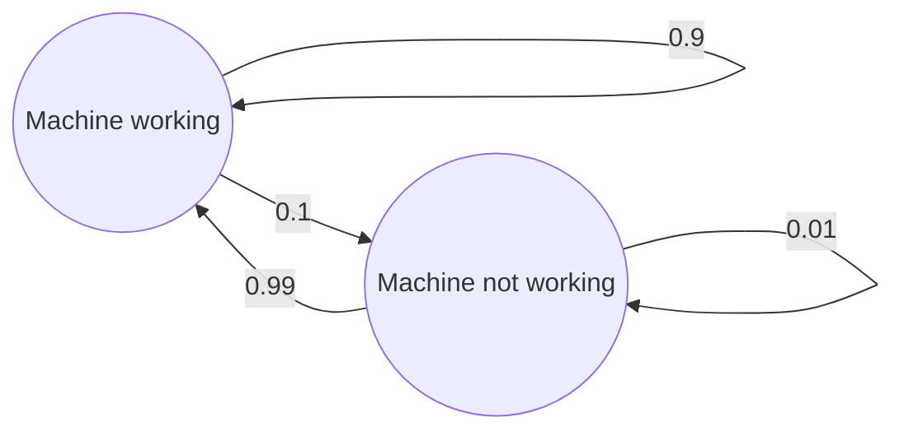

#### _INFO_

_This is shortened text from Probability and statistics 2. Almost all examples are omitted since this is just shortened version. Also you may find several notes of what was omitted and what is the reasoning behind that. Usually it is the lack of my time._

# Markov chains

- _"Some type of an automat, that represent probability space. It needs to have special properties."_

## Model

- States: $S$ it is usually finite and sometimes only countable.
- sequence $X_{0}, X_{1}, X_{2}, \dots$ of random variables with values in $S$
- $X_{t+1}$ depends **only** on $X_{t}$
- $\Pr [X_{t+1} = j \vert X_{t} = i] = p_{ij}$ where $i,j \in S$

## Definition:

Sequence of r.v. $X_{0},X_{1},X_{2},\dots$ is a **Markov chain** if:

- $\exist$ countable $S : \text{Rng } X_{t} \subset S$  $\forall t$
- $\forall t \in \mathbb{N}$ $\forall a_{0}, a_{1}, a_{2}, \dots , a_{t+1} \in S$

$$
\Pr[X_{t+1} = a_{t+1} \vert X_{0} = a_{0}, X_{1} = a_{1} , \dots ,X_{t} = a_{t}] = \Pr [X_{t+1} = a_{t+1} \vert X_{t} = a_{t}]

$$

This means that Markov chain has the property of being memory-less and this probability written above is called _transition probability_. We can map all elements from $S$ to a number from range $1,2,\dots ,n$ and then we can build **transition matrix**.

$$
P =
\begin{pmatrix}
p_{11} & p_{12} & p_{13} & \dots \\
p_{21} & p_{22} &  \\
p_{31} &  & \ddots \\
\vdots
\end{pmatrix}

$$

Where $p_{ij}$ means going from $i$ to $j$. All $p_{ij} \geq 0$ and the sum of each row is $1$. Also we can build **transition graph** representing this Markov chain. In that graph $V = S$ and arcs exists if $(ij) : p_{ij} > 0$.

Now we look at distribution, or PMF of $X_{k} = \pi^{(k)}$ where $\pi^{(k)} = \left( \pi_{1}^{(k)}, \pi_{2}^{(k)},\pi_{3}^{(k)}, \dots \right)$ and the sum is $1$. Then we may see that $\pi_{j}^{(k)} = \Pr[X_{k} = j]$. We will be calling $\pi^{(0)}$ an _initial state_.

Then we can see that $\pi^{(1)} = \pi^{(0)} P$ as multiplication by transition matrix. We can generalize this to:

$$
\pi^{(k)} = \pi^{(k-1)} P

$$

## Theorem:

For any _MC_ with transition matrix $P$ we have $\pi^{(k)} = \pi^{(0)} P^{k}$ and $\pi^{(k+1)} = \pi^{(t)} P^{k}$.

### Proof

_Proof will be by induction. So $\pi^{(k+1)} = \pi^{(k)} P = \pi^{(0)} P^{k} P =\pi^{(0)} P^{k+1}$._

$$
\Box

$$

## Definition:

**K-step transition** is defined as:

$$
\begin{array}{rcl}
r_{ij}(k) & := & \Pr[\text{from }i \text{ to } j \text{ in } k \text{ steps}] \\
& = & \Pr[X_{k} = j \vert X_{0} = i] \\
& = & \Pr[X_{t+k} = j \vert X_{t} = i] \\
r_{ij}(1) & = & p_{ij}
\end{array}

$$

## Observation

$$
r_{ij}(k) = \pi_{j}^{(k)} \text{ if } \pi^{0} = \left( 0, 0, \dots, 0, 1, 0 \dots, 0\right)

$$

Where $1$ is on $i$-th position. Also:

$$
\pi_{j}^{(k)} = (\pi^{0} P^{k})_{j} = \left( \left( 0, 0, \dots, 0, 1, 0 \dots, 0\right)P^{k}\right)_{j} = (P^{k})_{ij}

$$

## Chapman-Kologorov formula

$$
r_{ij}(k) = (P^{k})_{ij} \\
r_{ij}(k+l) = \sum_{t=1}^{S} r_{it}(k)r_{tj}(l) \\
r_{ij}(k+1) = \sum_{t=1}^{S} r_{it}(k) p_{tj}

$$

## Definition:

$j$ is **accessible** from $i$ if

$$
(j \in A(i), i \to j) \\
\Updownarrow \\
\Pr[\exist k \geq 0 : X_{k} = j \vert X_{0} = i] > 0 \\
\Updownarrow \\
\sum_{k=0}^{\infty} r_{ij}(k) > 0 \\
\Updownarrow \\
\exist \text{ a discrete path from } i \text{ to } j \\
\text{in the transition graph}

$$

## Definition:

$i$ and $j$ from $S$ are **commuting states** $(i \leftrightarrow j)$ iff $i \to j$ and $j \to i$.

## Lemma:

$\leftrightarrow$ is an equivalence relation.

### Proof

We need to show that it satisfies reflexivity, symmetry and transitivity.

1.  $i \leftrightarrow i$ which means $i \to i$ so $r_{ii}(0) =1$
2.  $i \leftrightarrow j$ iff $j \leftrightarrow i$ by definition
3.  $i \leftrightarrow j$ and $j \leftrightarrow t$ we want to show $i \leftrightarrow t$, but we know $i \to j \to t$ and $t \to j \to i$ so we use these paths (or just shorten them by first intersection).

$$
\Box

$$

## Definition:

An **equivalence class** in a Markov chain is a set of states that are commuting with each other. The set is maximal with its property. In other words, no additional state from $S$ can be included in the set without breaking the commuting property.

## Definition:

_MC_ is called **irreducible** if $\leftrightarrow$ has just $1$ equivalence class. This is equivalent to that $\forall ij : i \leftrightarrow j$.

_Or by graph theory we can say that the transition graph is strongly connected and when we compress these classes we get DAG._

## Definition:

$i \in S$ is called **recurrent** if $\forall j \in A(i) : i \in A(j)$ and **transient** otherwise.

## Theorem:

$i \in S$ we define $f_{ii} = \Pr[\exist t \geq 1 : X_{t} =i \vert X_{0} = i]$ or by words _"probability of going back to $i$"_. Then:

- $i$ is recurrent iff $f_{ii} = 1$
- $i$ is transient iff $f_{ii} < 1$

### Proof:

- $i$ is transient iff $\exist j \in A(i) : i \notin A(j)$
- starting with $X_{0} = i$ the probability $\exists t \geq 1 : X_{t} = j$ is $p > 0$ and $\Pr[\text{going to } i \text{ from } j] = 0 \Rightarrow f_{ii} \leq 1 - p$
- And if $i$ is recurrent then $f_{ii} = 1$.

$$
\Box

$$

## Definition:

- $i \in S$ we define $V_{i}$ as number of visits to $i$ or written as $|\{t : X_{t} = i\}|$
- $V_{i} \in \mathbb{N} \cup \{\infty\}$ so it is a random variable defined by $X_{0}, X_{1}, \dots$

## Theorem

- $i$ is recurrent $\Rightarrow \Pr[V_{i} = \infty | X_{0} = i] = 1$
- $i$ is transient $\Rightarrow (V_{i} \vert X_{0}= i) \sim \text{Geom}(1 - f_{ii})$, where $(1-f_{ii})$ is called as _escape probability_.

# Steady State

## Definition:

Let $\pi$ be a distribution on $S$ such that $\left( \pi_{1} + \pi_{2} + \dots + \pi_{S} = 1, \pi_{i} > 0\right)$. Then $\pi$ is **stationary** distribution if $\pi P = \pi$. Or can be written as $\left[ \pi = (\pi_{1}, \pi_{2}, \dots) \vert \forall j \pi_{j} = \sum_{i \in S} \pi_{i} p_{ij}\right]$ for _MC_ with transition matrix $P$.

## Observation

If $\pi^{(0)} = \pi$ and $\pi$ is stationary then $\pi^{(1)} = \pi$ and $\forall k : \pi^{(k)} = \pi$.

## Definition:

- $s \in S$ is **periodic** if $\exists \Delta \geq 2$ integer such that $\Pr[X_{t} = s \vert X_{0} = s] > 0 \Rightarrow \Delta \vert t$.
- _MC_ is periodic if all its states are periodic, otherwise it is _aperiodic_.

## Theorem

$(X_{t})_{t = 0}^{\infty}$ is a _MC_ that is _irreducible_, _aperiodic_ and $|S| < \infty$. Then $\exist \pi$ that is a stationary distribution and

- $\forall j \forall i \lim_{k\to\infty}r_{ij}(k) = \pi_{j}$
- $\pi$ is a unique solution to

$$
\pi P = \pi \\
\pi \mathbf{1} = 1
% vector of 1s
% TODO: I think this is wrong. Pi is a probability distribution, so if pi_j is 1, then all other indexes must be 0.

$$

# Absorption probability

## Definition:

Absorption states are such states, that the probability of staying in the same state is $1$. Or it is $\{s \in S : p_{ss} = 1\}$.

## Lemma (Probability of Absorption)

Assume a _MC_ with absorbing state $0$ (and some move). Put

$$
a_{i} = \Pr[\exist t : X_{t} = 0 \vert X_{0} = i] \text{ for } i \in S

$$

Then $(a_{i})$ are the unique solution to:

$$
\begin{array}{rcll}
a_{0} & = & 1 \\
a_{i} & = & 0 &\text{ if } i \neq 0 \text{ and absorbing} \\
a_{i} & = & \sum_{j \in S} p_{ij} a_{j} & \text{ for } i \text{ not absorbing}
\end{array}

$$

### Proof

- $a_{0} = 1$ and $a_{i} = 0$ if $i \neq 0$ and absorbing is easy observation
- lets assume $i$ is not absorbing then

$$
a_{i} = \Pr[\exist t : X_{t} = 0 \vert X_{0} = i] = \\
= \sum_{j \in S} \Pr[X_{1} = j \vert X_{0} = i] \cdot \Pr[\exist t : X_{t} = 0 \vert X_{0} = i, X_{1} = j] = \\
= \sum_{j \in S} p_{ij} \Pr[\exist t : X_{t} = 0 \vert X_{0} = j] = \\
=\sum_{j \in S} p_{ij} a_{j} \\
\Box

$$

# Mean time to absorption

$A \subseteq S$ is set of all absorption states. $T = \min \{ t \geq 0 \vert X_{t} \in A\}$ is _absorption time_ and random variable. Then we define $\mu_{i} = \mathbb{E} [T \vert X_{0} = i]$.

## Theorem:

$(\mu_{i})_{i \in S}$ is the unique solution to:

$$
\begin{array}{rrcl}
\text{if } i \in A & \mu_{i} & = & 0 \\
\text{if } i \notin A & \mu_{i} & = &1 + \sum_{j \in S} p_{ij}\mu_{j}
\end{array}

$$

# SAT

Problem where there is given a Boolean formula and we have to say if it is satisfiable.

## 2-SAT (_polynomial_)

Special case of _SAT_ where all clauses have at most $2$ literals.

### Algorithm for 2-SAT

1.  Start with any assignment $(x_{1} = x_{2} = \dots = x_{n} = F)$
2.  Repeat up to $2mn^{2}$ times ($n$ is the number of variables and $m$ is an arbitrary parameter)
    - if $\varphi$ is satisfiable return "YES"
    - otherwise, choose any clause that is not satisfied and randomly change one of its variables $(\ast)$
3.  Return "NO"

$Pr[\text{incorrectly saying no}]  \leq \frac{1}{2m}$ which can be proved by Markov inequality.

$Pr[\text{incorrectly saying no}]  \leq \frac{1}{2^m}$ using iterative Markov inequality.

## 3-SAT

### Algortihm for 3-SAT

- Repeat for $\leq m$ times
  - Repeat for $\leq 3^{n/2}$ times
    - randomly initialize the variables
    - if $\varphi$ is satisfiable return "YES"
    - otherwise, choose any clause that is not satisfied and randomly change one of its variables

Running time of this algortihm is exponential in $n$.

$P[\text{failure}] \leq \frac{1}{2^m}$

By using a better algorithm we can get the exponential part to be $\frac{4^n}{3}$.

The idea behind these algorithms is that we are using a _random walk_ on the space of all possible assignments. This is a _Markov chain_. So we can easily calculate the probability of getting to the absorbing state and the mean time to get there.

## What is probability?

We may look at probability from different angles.

1.  Math concepts.
    - axioms, examples $\frac{\# \text{good}}{\#\text{all}}$, theorems ...
    - interesting/useful probabilistic method as "to show $A \neq 0$ we show $\Pr[A] >0$", lower bounds for Ramsey number
2.  Description of real world. Question: _Does Nature play dice?_
    - YES, if quantum theory is right so called _true randomness_
    - imprecise measurements so called _pseudo randomness_

Then we we have two possible approaches.

1.  **Frequntist's approach** $\frac{\text{\# good}}{\text{\# all}}$
2.  **Bayesian approach** as subjective probability, so we are counting with all possible universes and what is the probability this will happen in our universe.

# Bayesian statistics

1.  $\Theta$ is random variable describing some quantity of interest
2.  $X = (X_{1}, \dots, X_{n})$ measurements

_Note: In Frequentist's approach $\Theta$ does not exist we have $\vartheta$ as unknown fixed parameter._

| variable | PMF          | PDF          |
| -------- | ------------ | ------------ |
| 1        | $p_{\Theta}$ | $f_{\Theta}$ |
| 2        | $p_{X}$      | $f_{X}$      |

## Bayes theorem

$$
\Pr[B \vert A] = \frac{\Pr[B] \Pr[A \vert B]}{\Pr[A]}

$$

Where $\Pr[A], \Pr[B] > 0$. We will consider $B$ as $\Theta = \vartheta$ and $A$ as measurements $X = x$. Now we get:

$$
\Pr[\Theta = \vartheta \vert X = x] = \frac{\Pr[\Theta = \vartheta] \Pr[X = x \vert \Theta = \vartheta]}{\Pr[X = x]}

$$

Where $\Pr[\Theta = \vartheta \vert X = x]$ is called **posterior** and it is the probability after some measurements. $\Pr[\Theta = \vartheta]$ is called **prior** as an probability and $\Pr[X = x \vert \Theta = \vartheta]$ is our current model of the world (_likelihood_).

## Bayes theorem using PMF

$$
p_{\Theta\vert X} (\vartheta \vert x) = \frac{p_{\Theta}(\vartheta) p_{X\vert\Theta}(x \vert \vartheta)}{\sum_{\vartheta'} p_{\Theta}(\vartheta')p_{X\vert\Theta}(x \vert \vartheta')} = c p_{\Theta}(\vartheta) p_{X \vert \Theta}(x \vert \vartheta)

$$

For some konstant $c$.

### What do we want?

1.  Point estimate for $\Theta$.
2.  Interval estimate for $\Theta$.
3.  Hypothesis testing.

For _interval estimate_ we have given $X$ and want to find $[a,b]$ as $(a = a(X), b = b(X))$. $\Pr[a(x) < \Theta < b(X) \vert X = x] \geq 1 - \alpha$. Perhaps $\Pr[\Theta < a(x) \vert X =x ] = \frac{\alpha}{2}$ and $\Pr[\Theta > b(x) \vert X =x ] = \frac{\alpha}{2}$.

For _point estimate_ we have two approaches.

#### 1) MAP as for maximum aposteriori probability

$$
\hat{\vartheta} = \arg\max_{\vartheta} p_{\Theta \vert X} (\vartheta \vert x)

$$

If $X = x$ what is the most likely value?

#### 2) LMS as for least mean square

$$
\begin{array}{rcl}
\hat{\vartheta} & = & \arg\min_{\vartheta} \mathbb{E}[(\Theta - \vartheta)^{2} \vert X = x] \\
& = & \arg\min_{\vartheta} \mathbb{E}[\Theta \vert X = x]
\end{array}

$$

## Naive Bayes

By the Bayesian statistics we get for $X_{1}$:

$$
p_{\Theta\vert X_{1}} (\vartheta \vert x_{1}) = \frac{p_{\Theta}(\vartheta) p_{X_{1} \vert\Theta}(x_{1} \vert \vartheta)}{\sum_{\vartheta'} p_{\Theta}(\vartheta')p_{X_{1}\vert\Theta}(x_{1} \vert \vartheta')}

$$

But what if we have $n$ measurements to consider. Then we have $\Pr[\Theta = \vartheta \vert X_{1} = x_{1}, X_{2} = x_{2}, \dots]$ which can be computed by naive Bayes as:

$$
= \frac{p_{\Theta}(\vartheta) \prod_{i=1}^{n}p_{X_{i}\vert \Theta} (x_{i} \vert \vartheta)}{\sum_{\vartheta'} p_{\Theta}(\vartheta')\prod_{i=1}^{n}p_{X_{i}\vert \Theta} (x_{i} \vert \vartheta')}

$$

Also $p_{X \vert \Theta}(x_{i}, \dots, x_{1} \vert \Theta = \vartheta)$ is _joint PMF_ and we assume conditional independence.

## Bayes theorem using PDF

As for PMF we have Bayesian statistics for PDF.

$$
f_{\Theta \vert X}(\vartheta \vert x) = \frac{f_{\Theta}(\vartheta) f_{X \vert \Theta}(x \vert \vartheta)}{\int_{-\infty}^{\infty} f_{\Theta}(\vartheta') f_{X \vert \Theta} (x \vert \vartheta') \text{ d} \vartheta'}

$$

# Beta distribution

To see some nice properties of Bayesian theorem we will look into one new distribution. We will have $\alpha, \beta \geq 1$ and $\vartheta \in [0,1]$. Then

$$
f_{\Theta} (\vartheta) = \frac{\vartheta^{\alpha - 1} (1-\vartheta)^{\beta-1}}{\Beta(\alpha,\beta)}

$$

Where $\Beta(\alpha, \beta)$ is called **beta function** and for all $\alpha, \beta$ it is a constant. For example the beta function for $\Beta(1,1)$ is equal to $1$ from $[0,1]$ and $0$ otherwise. And $\Beta(1,2) = \frac{1}{2}$. It serves as a normalizing constant for the beta distribution.

- Firstly the maximum is at $\frac{\alpha -1}{\alpha + \beta - 2}$ which is the **mode** (_cz: modus_).
- Secondly

$$
\Beta(\alpha, \beta) = \frac{(\alpha - 1)! (\beta - 1)!}{(\alpha+\beta-2)!} = \frac{1}{\binom{\alpha + \beta - 2}{\alpha -1}}

$$

- Lastly $\mathbb{E} [\Theta] = \frac{\alpha}{\alpha + \beta}$ which is the **mean**.

Now we will look into the Bayesian theorem using Beta distribution as a prior and Binomial distribution as a likelihood.

$$
p_{X \vert \Theta}(k \vert \vartheta) = \binom{n}{k} \vartheta^{k} (1-\vartheta)^{n-k}

$$

$$
f_{\Theta \vert X}(\vartheta \vert x) = c_{1} \vartheta^{\alpha - 1}(1 - \vartheta)^{\beta - 1} \cdot c_{2} \vartheta^{x} (1- \beta)^{1-x} \cdot c_{3} =

$$

Where $c_{1},c_{2},c_{3}$ do not depend on $\vartheta$ and are some constants.

$$
= c_{4} \vartheta^{\alpha + k -1}(1 - \vartheta)^{\beta + n - k -1}

$$

And that is some other Beta distribution with $\alpha' = \alpha + x$ and $\beta' = \beta + n - x$. And also we have these point estimates:

1.  MAP $\hat{\vartheta} = \frac{x}{n}$ which is same as likelihood.
2.  LMS $\hat{\vartheta} = \mathbb{E}(\Theta \vert X = x) = \frac{x+1}{n+2}$

## Normal random variable

Also we can look at Bayesian theorem with normal variables. _Note: This doesn't seem so interesting and useful, since it is only computation and nothing else._

<!-- TODO: have a look at this if you have any time left -->

# Conditional expectation

Firstly we will remind how expectation is defined. $\mathbb{E}[Y] = \sum_{y \in \text{Img}(Y)} y \Pr[Y = y]$ if $Y$ is discrete or $= \int_{-\infty}^{\infty} y f_{Y}(y) \text{ d}y$ if $y$ is continuous. Now we will show how conditional expectation is defined.

$$
\begin{array}{rcl}
\mathbb{E}[Y \vert A] & = & \sum_{y \in \text{Img}(Y)}y \Pr[Y = y \vert A] \\ \\
& = & \int_{-\infty}^{\infty} y f_{Y \vert A}(y) \text{ d}y
\end{array}

$$

Now if we have $X,Y$ discrete random variables and $x \in \mathbb{R}$, then:

$$
\mathbb{E}[Y \vert X = x] =: g(x)

$$

So $g$ is a function $\mathbb{R} \to \mathbb{R}$. Then

$$
\mathbb{E} [Y \vert X] =: g(X)

$$

So we have two functions $\Omega \to^{X} \mathbb{R} \to^{g} \mathbb{R}$. Now we will show one property which is called **Law of Iterated Expectation**.

$$
\mathbb{E}[\mathbb{E}[Y \vert X]] =^{\text{DEF}} \mathbb{E}[g(X)] =^{\text{LOTUS}} \sum_{x \in \text{Img}(X)}g(x) \Pr[X = x] = \\
=^{\text{DEF}} \sum_{x \in \text{Img}(X)}\Pr[X=x] \mathbb{E} [Y \vert X =x] = \mathbb{E}[Y]

$$

Where the last equivalence is by the Law of total Expectation. So by this we get $\mathbb{E}[\mathbb{E}[Y \vert X]] = \mathbb{E}[Y]$ if $\mathbb{E}[Y] < \infty$.

Now, we will use a similar approach to find an alternative definition of variance.

Let $Y = \hat{Y} - \tilde{Y} $ where $\hat{Y}$ and $\tilde{Y}$ are statistically independent and $var(\tilde{Y}) = \mathbb{E}[\tilde{Y}^2]$

$$

var(Y) = var(\hat{Y}) + var(\tilde{Y}) - 2cov(\hat{Y}, \tilde{Y})

$$

From the property of the statistical independence we get $cov(\hat{Y}, \tilde{Y}) = 0$.

$$
\mathbb{E} [(Y - E[Y\vert X])^2 \vert X] = var[Y \vert X] =: h(X)

$$

### Law of iterated variance

$$
\text{var} [Y] = \mathbb{E}[\text{var}[Y \vert X]] + \text{var}[\mathbb{E}[Y \vert X]]

$$

Or it is called an **Eve's rule** (_as E for expected value and V for variance_). We may simulate it by saying that the first part of the sum is expected value of variance within one group and the second part is inter group variance. _This is also partly from the example that was sadly omitted._

Next we can show that Least Mean Square is iff condition expectation. That is for given $Y$ what is the value of $y$ that minimizes $\mathbb{E}[Y - y]^{2}$?

$$
\mathbb{E}[Y - y]^{2} = \mathbb{E}[Y^{2}] - 2y\mathbb{E}[Y] + y^{2} = f(y) \\
f'(y) = - 2 \mathbb{E}[Y] + 2y = 0 \Rightarrow y = \mathbb{E}[Y]

$$

Now we want for all $x$ find $y = y(x)$ such that $\mathbb{E}[(Y - y(x))^{2} \vert X = x]$ is minimized. We can show by similar calculation that $y(x) = \mathbb{E}[Y \vert X =x ]$. And our best (in the LMS sense) estimation is $\hat{Y} = \mathbb{E} [Y \vert X]$.

# Stochastic processes

Stochastic process is a sequence of random variables $X_{1}, X_{2}, X_{3}, \dots$. We will show that there exist many of them.

- Markov chain (_\+ extra condition_)
- Wiener process
  - Browner motion
  - Stock prices
  - Limit version of RN
- **Arrival times** or alternatively **waiting for success**.

We will be looking at the last type of the processes.

## Bernoulli process (_denoted as_ $\text{Bp}(p)$)

That is we have $X_{1}, X_{2}, \dots$ iid and each one of them is $X_{i} \sim \text{Ber}(p)$ so with probability $p$ it is $1$ and $0$ with probability $1-p$.

### Observations

- $X_{n}, X_{n+1}, \dots$ is also $\text{Bp}(p)$
- $X_{N}, X_{N+1}, \dots$ is also $\text{Bp}(p)$
  - with $N$ a random variable dependent only on the past

Then we will define $T =\min \{t : X_{t} = 1\}$ or by words the time of the first success / arrival. And we can easily see that $T \sim \text{Geom}(p)$ so $\mathbb{E}[T] = \frac{1}{p}$ and $\text{var} [T] = \frac{1-p}{p^{2}}$.

Now we will try to generalize this by $T_{k}$ as the time of the $k$-th arrival. So $T_{1} = T$. Or written as $T_{k} = \min \{t : X_{1} + X_{2} + \dots + X_{t} = k\}$.

Other interesting variable is the $k$-th waiting time (inter arrival) and it will be denoted as $L_{k}$. To describe this variable it is the time between $k-1$ arrival and $k$-th arrival. Then it follows

$$
L_{k} = T_{k} - T_{k-1} \text{ when we put } T_{0} = 0 \\
L_{k} \sim L_{1} = T \Rightarrow L_{k} \sim \text{Geom}(p)

$$

And all $L_{i}$ are independent. From the other way we can define $T_{k}$ as the sum $\sum_{i=1}^{k} = L_{i}$. So we can then get expected value and variance.

$$
\mathbb{E}[T_{k}] = \mathbb{E}[L_{1}] + \mathbb{E}[L_{2}] + \dots + \mathbb{E}[L_{k}] = \frac{k}{p}

$$

$$
\text{var}[T_{k}] = \text{var}[L_{1}] + \text{var}[L_{2}] + \dots + \text{var}[L_{k}] = k \cdot \frac{1-p}{p^{2}}

$$

How could we compute $\Pr[T_{k} = t] = ?$ Easily we can compute this by convolution formula $\binom{t-1}{k-1} p^{k}(1-p)^{t-k}$.

Lastly we define $N_{t}$ as the sum $X_{1} + X_{2} + \dots + X_{t}$ which is the number of successes till the time $t$. And $N_{t} \sim \text{Bin}(t,p)$. So $\mathbb{E}[N_{t}] = tp$ and $\text{var}[N_{t}] = tp(1-p)$.

### Alternative definition

We can define Bernoulli process by different definition. First we will define $L_{1}, L_{2}, \dots$ as iid $\sim \text{Geom}(p)$ and then $T_{k} = \sum_{i=1}^{k} L_{i}$. And $X_{i}$ is $1$ if $T_{k} = i$ for some $k$ or $0$ otherwise. Then $(X_{i})_{i}$ is $\text{Bp}(p)$.

### Merging of Bernoulli process

We will have two processes which are independent.

$$
\begin{array}{rl}
X_{1}, X_{2}, X_{3}, \dots & \text{Bp}(p) \\
Y_{1}, Y_{2}, Y_{3}, \dots & \text{Bp}(q)
\end{array}

$$

Then the merge is $Z_{i} = X_{i} \text{ or } Y_{i}$. Properly it is

$$
\begin{array}{rl}
Z_{1}, Z_{2}, Z_{3}, \dots & \text{Bp}(p + q - pq) = \text{Bp}(1 - (1-p)(1-q))
\end{array}

$$

### Splitting Bernoulli process

We can also split one Bernoulli process. Firstly we got

$$
\begin{array}{rl}
Z_{1}, Z_{2}, Z_{3}\dots & \text{Bp}(r)
\end{array}

$$

If $Z_{i}=1$ then $X_{i} = 1$ with probability $\alpha$ and $0$ with probability $(1 - \alpha)$ and if $Z_{i} = 0$ then $X_{i}=0$. By this construction we get new Bernoulli process.

$$
\begin{array}{rl}
X_{1}, X_{2}, X_{3}, \dots & \text{Bp}(\alpha r)
\end{array}

$$

## Poisson process (_denoted as_ $\text{Pp}(\lambda)$)

As we defined Bernoulli process we also can define Poisson process which can be described as a continuous approximation of $\text{Bp}(p)$. Now the arrival times are real numbers.

### Definition:

1.  For any interval of length $\tau$ probability of $k$ arrivals is the same. Denoted as $P(k, \tau)$.
2.  Number of arrivals in $[a,b]$ is independent of number in $[0, a)$.
3.  $P(0, \tau) = 1 - \lambda \tau + o(1)$, $P(1, \tau) = \lambda \tau + o(1)$, $P(k, \tau) = o(1)$. for $k \geq 2$ where $o(1)$ is something that goes to zero

<!-- TODO: What is the small o?? -->

Then the sequence $T_{1}. T_{2}, T_{3}, \dots$ is $\text{Pp}(\lambda)$ where Ts are the arrival times.

<!-- $Pr[N_t = k] = P(k, t) = $ -->

As in Bernoulli process we have $T_{k}$ as the time of $k$-th arrival. Then $N_{T}$ is the number of arrivals in $[0,t]$ and $N_{T} \sim \text{Pois}(\lambda t)$ so $P(k, t) = e^{-\lambda t} \frac{(\lambda t)^{k}}{k!}$.

We can show that by the following approximation:

$$
Pr[N_t = k] = P(k,t) \implies P(1, \frac{t}{l}) = \frac{\lambda t}{l} + o(1) \newline
Pr[N_t = k] = P(k, t) \approx P[\text{there are K small intervals that has 1 arrival}] = Pr[Bin(l, \frac{\lambda t}{l}) = k] \newline \implies lim_{l \to \infty} Bin(l, \frac{\lambda t}{l}) \to Pois(\lambda  t)

$$

Then again $L_{k} = T_{k} - T_{k-1}$ so $\Pr[L_{k} \geq t] = \Pr[\text{no arrival in }[T_{k-1}, T_{k-1}+t]]$ and that is equal to $P(0,t) = e^{-\lambda t}$. Next $\Pr[L_{k} \leq t] = 1 - e^{-\lambda t} \Rightarrow L_{k} \sim \text{Exp}(\lambda)$.

### Alternative description

As in Bernoulli process we can define Poisson process the other way around. We start with sequence of iid $L_{1}, L_{2}, \dots \sim \text{Exp}(\lambda)$. Then $T_{k}$ is the sum $T_{k} = \sum_{i=1}^{k} L_{i}$. And we also get the same $N_{t}$.

### Theorem

This also defines $\text{Pp}(\lambda)$. In other words it satisfies all of the three properties.

Again as in Bp we can see that expected value of $T_{k}$ and variance is the sum of expected values (resp. variances) of $L_{i}$ which are $\frac{1}{\lambda}$ (resp. $\frac{1}{\lambda^{2}}$). By convolution we get that

$$
f_{T_{k}} (t) = \frac{\lambda^{k} t^{k-1}e^{-\lambda t}}{(k-1)!}

$$

### Splitting of Pp

We have a $\text{Pp}(\lambda)$ and each one is split (1 or 0) with probability $p$ (resp. $1-p$). And then we get two processes $\text{Pp}(p \lambda)$ and $\text{Pp}((1-p) \lambda)$ and these are independent. Two new processes have still the same properties but with new $\lambda'$. To properly show that this holds we need to show all the properties from the definition.

<!-- TODO -->

$$

Pr[T_1 > t] = Pr[T>t \ \&  \ T' > t] =  \dots

$$

_Note:
Proving independece is quite cumbersome. The proof is based on an example from the lecture._

### Merging of Pp

If we have two processes $\text{Pp}(\lambda)$ and $\text{Pp}(\lambda')$ we can merge these to get $\text{Pp}(\lambda + \lambda')$. Again to properly show that this holds we must show that the $\min$ of two $\text{Exp}$ distributions is again $\text{Exp}$ distribution with the sum. Which is quite easy since they are independent, then we get the product of exponent functions which is the same as the sum of their exponents.

What if we look at the $\Pr[T - t > s \vert T > t]$ which by definition is $\frac{\Pr[T > s+t \land T > t]}{\Pr [T > t]}$ and that is equal to $\frac{e^{-\lambda (s+t)}}{e^{-\lambda t}} e^{-\lambda s}$ and we get the property that the Poisson process is **memory-less** so it doesn't matter when we will start measuring our data.

# Balls & Bins

This model is if we have $m$ balls and $n$ bins and for each ball we put it independently at random to one bin, where each bin has the same probability.

One well known problem is _Birthday paradox_ where we have $k$ people as balls and $365$ days as bins. Then we are asking what is the probability that one bin has at least 2 balls.

$$

Pr[\text{at least 2 balls in one bin}] = 1 - Pr[\text{max 1 ball in one bin}] = \\
= 1 - \prod_{i=1}^{m-1} \frac{n-i}{n} \approx 1 - \prod_{i=1}^{m-1} e^{\frac{-i}{n}} = 1 - e^{\frac{-m(m-1)}{2n}}

$$

We also consider other properties, such as the expected number of empty bins:

$$
Pr[\text{bin } i \text{ is empty}] = (1 - \frac{1}{n})^{m} \approx e^{\frac{-m}{n}}

$$

$$

\mathbb{E}[ \text{\# of empty bins}] = n (1- \frac{1}{n})^{m} \approx n e^{\frac{-m}{n}}

$$

## Max Load Theorem

if $m=n$ and are big enough and $M = 3 \frac{ln(n)}{ln(ln(n))}$ then $Pr[\text{max \# of balls in a bin} > M] < \frac{1}{n}$

## Proof

<!-- TODO: I don't think this is right. The proba of the Bin distribution should be smaller not greater than >= M balls -->

$$

Pr[\text{bin } \#1 \text{ has} \geq M \text{ balls} ]  \leq Pr[Bin(n, \frac{1}{n}) = M] < \frac{1}{M!} < (\frac{e}{M})^M
% The binomial distribution is wrong in this case

$$

$$

Pr[\text{any bin has} \geq M \text{ balls} ] \leq Pr[\text{bin } \#1 \text{ has} \geq M \text{ balls} ] + \dots + Pr[\text{bin } \#n \text{ has} \geq M \text{ balls} ] \leq n (\frac{e}{M})^M

$$

Now we will show that this expression is smaller than $\frac{1}{n}$. In order to do that, we wil take the logarithm of both sides and we get:

$$

2ln(n) + M(1-ln(M)) < 0

$$

We will then substitute $M$ and show that the inequality holds.

$$
\Box
$$

M balls and bins have multiple applications. We will use it for hashing and sorting.

## Bucket Sort Application

We want to sort $n = 2^k$ numbers from range $[0, 2^l-1]$ where $l > k$. The numbers are uniformly random in this range.

### Algorithm

1. Put input $x$ to a bucket $b(x)$ where $b(x)$ is a hash function of $x$ and bucket is a list
2. Sort each bucket (list) by a bubble sort in quadratic time
3. merge the buckets

### Time Analysis

Parts 1 and 3 are linear in $n$

For part 2, we will consider $X_i = \# \text{of inputs in the ith bucket} \sim Bin(n, \frac{1}{n}) $. Then $\mathbb{E} \text{ time} = \mathbb{E} \sum (c_iX_i^2)$
Finally, we will use the definition of variance to show that the expected time is $ < 2cn$. Hence the whole algorithm has linear expected time.

## Hash Collisions Application

We want to store $n$ strings and search fast. Using the max load theorem, we will show that max running time with a big enough $n$ is $< 3 \frac{ln(n)}{ln(ln(n))} $

## Theorem

Distribution of $X^{(m)}_{1}, \dots, X^{(m)}_n$, where $X_i^{(m)} $ represents the number of balls in bin $i$, is the same as $Y^{(m)}_1, \dots Y^{(m),}_n \ iid$, where $Y^{(m)}_i \sim Pois(\frac{m}{n})$ and $\sum Y_i^{(m)} = k$

## Proof

It is based on the fact that $X^{(m)}_1 \sim Bin(m, \frac{1}{n}) \approx Pois(\frac{m}{n})$ and then we show that $Pr[X^{(m)}_1 = k_1, \dots X^{(m)}_n = k_n] = P_x = P_Y = Pr[Y^{(m)}_1 = k_1 \dots \vert \sum Y_i = k ]$

## Max Load Theorem 2

if $m=n$ and are big enough and $M = \frac{ln(n)}{ln(ln(n))}$ then $Pr[\text{max \# of balls in a bin} < M] \leq \frac{1}{n}$

# Non-parametric statistics

In parametric statistics, we assume that the data comes from a known distribution and we try to estimate a parameter of that distribution. In non-parametric statistics, we don't assume anything about the distribution of the data.

## Permutation test

is a technique to decide whether observed random variables come from the same distribution or not.

$X_1, \dots, X_m \newline Y_1, \dots, Y_n$

$H_0:$ All of these random variables come from the same distribution.

The quantity computed from values in a sample (statistic) $T$ is the difference of means of Xs and Ys.

$$
T := \bar{X}_m - \bar{Y}_n
$$

Alternatively we can use the two-sided test:

$$
T := \vert \bar{X}_m - \bar{Y}_n \vert

$$

We pick a paramater $\gamma$ and if $T \geq \gamma$ then we reject $H_0$. In order to decide $\gamma$, we want our test to be statistically significant. Hence the following must hold: $Pr[\text{wrong rejection} ] < \alpha = 0.05$

So we will compute $\gamma$ based on the set of all measured values. Next, the observations of groups $X$ and $Y$ are pooled, and the difference in sample means is calculated and recorded for every possible way of dividing the pooled values into two groups of size $\vert X \vert$ and $\vert Y \vert$. The set of these calculated differences is the exact distribution of possible differences under the null hypothesis that group labels are exchangeable.The p-value of the test is calculated as the proportion of sampled permutations where the difference in means was greater than $T$.

If $(m+n)!$ is too big, we can use a random permutation test. We will generate $k$ random permutations and compute the test statistic for each of them.

## One-sampled Sign test

$X_1, \dots X_n \ i.i.d. $ They have unknown distribution which is continuous, has median $\mu$, possibly mean $\mu$ and is symmetric around $\mu$.

$H_0: \mu = 0$

$Y_i = sgn(X_i)$ is either 1 or 0

<!-- TODO: what happens in case when all Xs are zeros? Do we just skip them? -->

$Y = \sum Y_i \sim Bin(n, \frac{1}{2})$ assuming $H_0$. Next, we consider the dsitrubution of $Y$ and compute the quantiles based on $\alpha$. If $Y > y_{1-\frac{\alpha}{2}}$ or $Y < y_{\frac{\alpha}{2}}$ then we reject $H_0$.

## Paired Sign test

$(X_1, Y_2), \dots , (X_n, Y_n)$

$H_0 : \mathbb{E}[X]  = \mathbb{E}[Y]$ alternatively $\mathbb{E}[X-Y] = 0$

We create a new variqble $Z_i = X_i - Y_i $ and we apply the one-sample sign test on $Z_i$.

## Wilcoxon signed-rank test

The one-sample Wilcoxon signed-rank test can be used to test whether data comes from a symmetric population with a specified median.

$X_1, \dots, X_n$ median is $0$

$H_0: \mu = 0$

We sort $\vert X_1 \vert, \dots, \vert X_n \vert$ and assign ranks $r_1, \dots, r_n$ to them. In case the numbers are the same, we compute the mean of the range. Then we compute $T = \sum_{i=1}^n r_i sgn(X_i)$ which can be computed as $T = T^+ - T^-$

We reject the null hypothesis if $T$ is too large or too small.

## Mann-Whitney U-test

2-sample non-parametric test, which checks whether two samples come from the same distribution.

We compute statistics $U = \sum^{|X|}_i \sum^{|Y|}_j S(X_i, Y_j)$

where $S(X_i, Y_j) = 0$ if $X_i > Y_j$, $S(X_i, Y_j) = 1$ when it is the other way around and $\frac{1}{2}$ if they are equal.

It is a form of a permutation test.

# Consequences of statistical designs

## Simpson's paradox

Simpson's paradox is a phenomenon in probability and statistics in which a trend appears in several groups of data but disappears or reverses when the groups are combined.

**Example:** Females at Harvard have overall smaller success rate than males. However, when compared their success rates in separate majors, females usually dominate. This means that most of the females apply to more competitive majors.

## Time dependency

$X_1, \dots X_n$ all tests assume $i.i.d.$ however, in reality, the data is dependent. $\mathbb{E}[X_i]$ depends on $i$.

We can test this phenomenon by replacing $X_i$ by $X_i - \mu$ where $\mu$ is the median of the measured data. Then we can observe the sequence of pluses and minuses. If the sequence is random, then we can assume that the data is independent.

# Moment Generating Function

## Definition

If $X$ is a random variable, $s \in \R$ then $M_X(s) = \mathbb{E}[e^{sX}]$ where $M_X$ is the moment generating function of $X$.

## Theorem

For all $s$ where $M_X(s)$ is defined and finite:

$$

M_X(s) = \sum_{k=0}^\infty \frac{1}{k!} \mathbb{E}[X^k] s^k

$$

## Proof

$\mathbb{E}[X^k]$ is called the $k$-th moment.

$\mathbb{E}[X^2] = var(X) + \mathbb{E}[X]^2$

$$

e^s = \sum_{k=0}^\infty \frac{s^k}{k!}

$$

$$
\mathbb{E}[e^{sX}] = \mathbb{E}[\sum^{\infin}_{k=0} \frac{(sX)^k}{k!}] = \sum^{\infin}_{k=0} \frac{1}{k!} \mathbb{E}[X^k] s^k

\newline
\Box

$$

For continuous distribution $Y$, we compute MGF with the help of LOTUS rule as follows:

$$
M_Y(s) = \int_{-\infty}^\infty e^{sy} f_Y(y) dy

$$

## Theorem

$$

M_{aX+b}(s) = e^{bs}M_X(as)

$$

## Theorem

if $X$ and $Y$ are independent, then $M_{X+Y}(s) = M_X(s)M_Y(s)$

## Theorem

$\exists \epsilon > 0 \forall s \in [-\epsilon, \epsilon]: M_X(s) = M_Y(s) \in \R \implies F_X = F_Y$

## Theorem

$\exists \epsilon > 0 \forall s \in [-\epsilon, \epsilon]: M_{Y_n}(s) \rightarrow  M_Z(s) \in \R \ \&  \ F_Z \text{ is continuous } \implies F_{Y_n} \rightarrow F_Z$

In this case instead of two random variables, we have a sequence of random variables.

## Central Limit Theorem

$X_1, \dots, X_n \ \ i.i.d., \ \ \mathbb{E}[X_i] = \mu, \ \ var(X_i) = \sigma^2$

$Y_n = \frac{1}{\sigma \sqrt{n}} ((\sum_{i=1}^n X_i) - n \mu)$

Then $Y_n$ converges to $\mathcal{N}(0, 1)$

## Chernooff's theorem

$X_1, \dots, X_n \ \ i.i.d., \sim Bern(\frac{1}{2})$

$X = X_1 + \dots + X_n, \ \ \ var(X) = n$

$t > 0: Pr[X \leq -t] = Pr[X \geq t] \leq e^{\frac{-t^2}{2\sigma^2}}$

# Source coding theorem

How to encode the information in the most efficient way?

Model: sequence of $X_1, \dots, X_n i.i.d.$ over finite alphabet.

Goal: find the most efficient encoding of the sequence.

$X = (X_1, \dots, X_n)$

$L(n \epsilon) = min \{ L : \exists C_n \sub A^n \ \  s.t. \ |C_n| < 2^l \ \& \ Pr[X \in C_n] \geq 1 -\epsilon \}$

## Shannon's source coding theorem

$$
\forall \epsilon > 0: lim_{n \rightarrow \infty} \frac{L(n \epsilon)}{n} = H(X)
$$

